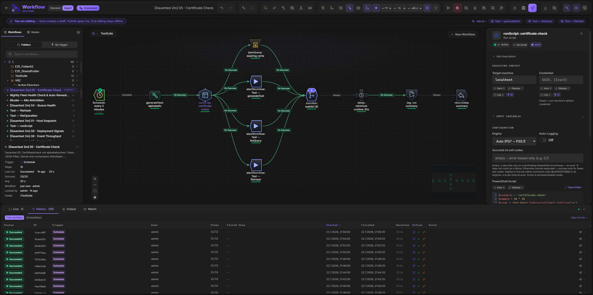
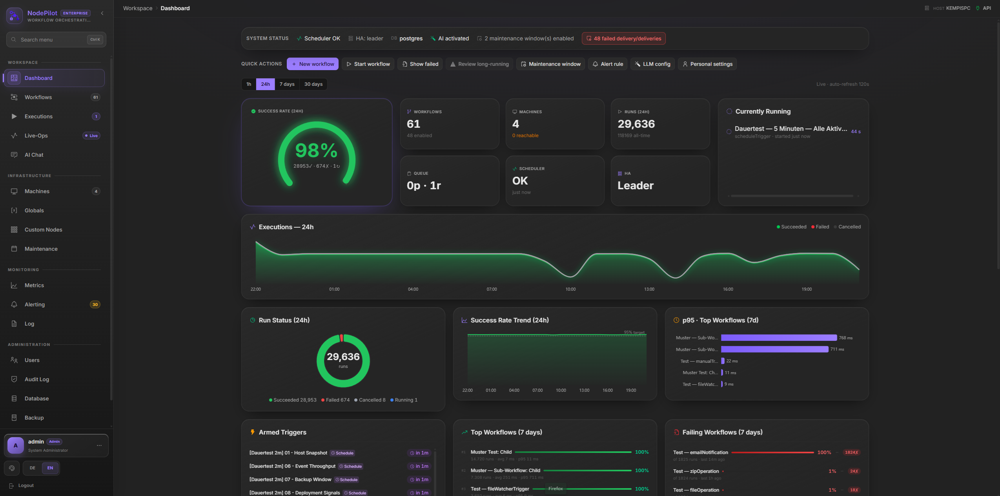
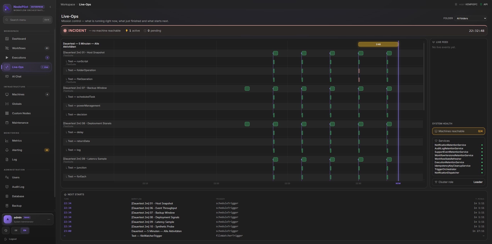
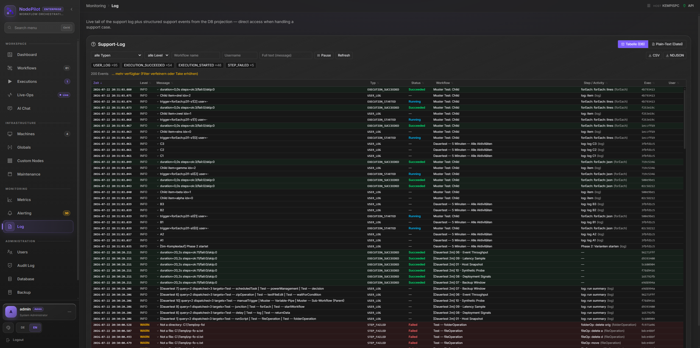

<div align="center">

# NodePilot

**Agentless Windows workflow orchestration — a modern, open replacement for Microsoft System Center Orchestrator.**

Design, schedule, debug, and observe multi-step automation in your browser. Run PowerShell, file/registry/service operations, REST calls, SQL, and more across your Windows estate over WinRM — no agents on the targets.

[](https://github.com/Sev7eNup/NodePilot/actions/workflows/ci.yml)


</div>

---

## Screenshots

<details open>
<summary><b>🎨 Workflow Designer</b></summary>



</details>

<details>
<summary><b>📊 Dashboard</b></summary>



</details>

<details>
<summary><b>🛰️ Live-Ops Mission Control</b></summary>



</details>

<details>
<summary><b>🧾 Support Log — live tail</b></summary>



</details>

---

## Table of Contents

- [Why NodePilot](#why-nodepilot)
- [Quick Start](#quick-start)
- [Workflow Designer (Frontend)](#workflow-designer-frontend)
  - [Editor toolbar — seven clusters at a glance](#editor-toolbar--seven-clusters-at-a-glance)
  - [Canvas](#canvas)
  - [Node palette](#node-palette)
  - [Properties panel](#properties-panel)
  - [Edge conditions](#edge-conditions)
  - [Step debugger](#step-debugger)
  - [Power-user features](#power-user-features)
  - [Keyboard shortcuts](#keyboard-shortcuts)
  - [Execution history & Gantt timeline](#execution-history--gantt-timeline)
  - [App-level pages](#app-level-pages)
- [Workflow Engine (Backend)](#workflow-engine-backend)
- [Activity Catalog](#activity-catalog)
- [Triggers](#triggers)
- [Variable System](#variable-system)
- [Sub-Workflows & Loops](#sub-workflows--loops)
- [Workflow Edit Lifecycle](#workflow-edit-lifecycle)
- [AI Features](#ai-features)
- [`np` — the operations CLI](#np--the-operations-cli)
- [Observability — Grafana Stack](#observability--grafana-stack)
- [Security](#security)
- [Production Deployment](#production-deployment)
- [Configuration Reference](#configuration-reference)
- [Project Structure](#project-structure)
- [Testing](#testing)
- [API](#api)
- [Contributing](#contributing)
- [License](#license)
- [Acknowledgments](#acknowledgments)

---

## Why NodePilot

NodePilot is a **drop-in modern alternative** for organizations stuck on legacy SCOrch — same agentless model, same target audience (sysadmins automating Windows estates), but built on a current stack with a UX that doesn't feel like a 2010 MMC snap-in.

**Highlights**

- **Visual designer** — drag-and-drop canvas with 27 activity types, 6 triggers, typed nodes, a visual condition builder, and a seven-cluster toolbar that puts every editing affordance one click away.
- **True parallel engine** — event-driven scheduling loop with real fan-out / fan-in, three junction modes (`waitAll` / `waitAny` / `waitNofM`), per-step DI scope, and skip propagation.
- **Step debugger** — breakpoints, conditional breakpoints, step-over, **live variable inspector** with **runtime overrides**, and **time-scrubbing replay** in the Gantt timeline.
- **Real-time UI** — SignalR streams step status, output, and variables to every connected client as the workflow runs.
- **Agentless remote execution** — WinRM + PowerShell SDK; localhost runs in-process without WinRM.
- **AI-assisted authoring** — generate PowerShell scripts and entire workflows from natural language; works against OpenAI **or local Ollama / LM Studio / vLLM** for zero-egress setups.
- **Operations CLI (`np`)** — full-featured command-line client (login, run, watch, audit, lock/publish, import/export) packaged as a `dotnet global tool`.
- **Batteries-included observability** — opt-in OpenTelemetry + Prometheus exporter, plus a turnkey **Grafana stack with 10 pre-provisioned dashboards** (Mission Control, Workflows, Activities, WinRM, Triggers, API, Runtime, Security, AI, Database).
- **SCOrch-style edit lock** — atomic per-user check-out / publish flow, `423 Locked` enforced by every mutating endpoint, force-unlock for admins with audit trail.
- **Workflow versioning** — every edit is snapshotted; one-click rollback; visual diff between any two versions.
- **JWT + RBAC** — Admin / Operator / Viewer roles, BCrypt passwords, account lockout, DPAPI-encrypted credentials, output redaction, SSRF guards, per-IP rate limits.
- **AD SSO Preview (opt-in)** — hardened LDAP/Kerberos, OIDC + SCIM, server-side sessions and directory-backed RBAC complement Active/Passive **HA**, secret providers and **ECS-JSON SIEM** logging. Production status remains Preview until the real AD/Kerberos/LDAPS field gate passes. See [docs/enterprise-features.md](docs/enterprise-features.md).
- **Production-grade deployment** — turnkey PowerShell installer for Windows Service under a **gMSA**, direct Kestrel HTTPS, install/data-dir split, in-place upgrades with auto-rollback.

---

## Quick Start

### Requirements

- **OS:** Windows 10 / 11 or Windows Server 2019+ (WinRM and DPAPI are Windows-specific)
- **.NET 10 SDK** — [download](https://dotnet.microsoft.com/download)
- **Node.js 20+** — [download](https://nodejs.org/)
- **PostgreSQL 16+** *(default)* — or **SQL Server 2022** if you set `Database:Provider: sqlserver`

> NodePilot is **Windows-only by design** — the engine drives PowerShell remoting via WinRM and protects credentials with DPAPI.

### 1. Configure the database

The app DB ships with a Postgres-first setup. Point `ConnectionStrings:Postgres` at any reachable PostgreSQL instance — the migration set is applied automatically on first start.

```jsonc
// src/NodePilot.Api/appsettings.Development.json
{
  "Database": { "Provider": "postgres" },
  "ConnectionStrings": {
    "Postgres": "Host=localhost;Port=5432;Database=nodepilot;Username=nodepilot;Password=changeme"
  }
}
```

### 2. Start the backend (port 5000)

```powershell
dotnet run --project src/NodePilot.Api --urls "http://localhost:5000"
```

On first start, NodePilot writes a one-time setup token to `admin-setup.token` in the working directory. Use it on the login screen to create your first Admin account.

### 3. Start the frontend (port 5173)

```powershell
cd src/nodepilot-ui
npm install
npm run dev
```

Open <http://localhost:5173> — the Vite dev server proxies `/api` and `/hubs` to the backend.

### 4. (optional) Bring up Grafana

```bash
cd grafana
docker compose up -d
# Grafana → http://localhost:3000   (admin / admin by default)
# Prometheus → http://localhost:9090
```

Enable the Prometheus exporter on the API:

```powershell
$env:OpenTelemetry__Enabled = "true"
$env:OpenTelemetry__Exporters__PrometheusScrape = "true"
```

See [grafana/README.md](grafana/README.md) for the full walk-through.

### Example workflow

Want to see the designer in action without building anything? Import the bundled
showcase — a nightly fleet health-check that fans out three parallel probes, gathers
them at a junction, and routes a decision to an alert or an all-green log:

```
scripts/readme-showcase-workflow.json
```

Import it via the **Workflows** page → *Import* (or `POST /api/import`). It exercises
every shape you'll meet in production — schedule trigger, `runScript`, `log`, `junction`
(waitAll), `decision`, `emailNotification`, `returnData`, plus three phase sticky-notes —
laid out to fill the canvas width and run top-to-bottom.

---

## Workflow Designer (Frontend)

The designer is a React 19 + TypeScript 6 SPA built on [@xyflow/react](https://reactflow.dev/) (React Flow v12), styled with Tailwind CSS 4, and bundled by Vite 8. Auto-layout uses **Dagre** and **ELK**; the script editor is **Monaco**; live updates ride **SignalR (`@microsoft/signalr`)**; data fetching is **TanStack Query**; state is **Zustand**; forms are **React Hook Form + Zod**. It lives at `/workflows/:id`.

### Editor toolbar — seven clusters at a glance

The sticky header above the canvas is split into **seven visually-spaced clusters**. Each cluster wraps its items in a tight `gap-1` flex; the parent uses a 6× larger gap between clusters so groups read as units without explicit dividers. Clusters appear and disappear automatically based on RBAC and edit-lock state — Viewers, Operators, and the lock owner each see exactly the affordances they can use.

| # | Cluster | Buttons / controls | When visible |
|---|---|---|---|
| 1 | **History** | Undo · Redo *(with disabled state when stack is empty)* | Always |
| 2 | **Layout** | **Tidy** (Ctrl+Shift+T) — cycles through layout modes (Dagre LTR / Dagre TB / ELK layered / ELK force-directed / compact …); each click applies the next mode • **Orig** — restores the layout that existed before the first auto-arrange | When you hold the edit lock |
| 3 | **Inspect / Status** | **Search nodes** (Ctrl+F) · **Find & Replace** (Ctrl+H) · **Zoom-to-Selection** (Ctrl+Shift+E) · **Diff** vs any previous version · **Dry-Run** simulator (highlights which nodes would fire assuming success; click again to clear) · **Keyboard shortcut overlay** (?) — and globally available: **Quick-Switcher** (Ctrl+P, fuzzy workflow jump) and **Command Palette** (Ctrl+Shift+P, every action with shortcut hint) | Always |
| 4 | **View / Canvas** | **Ansicht (DesignToggle)** — edge animation (`A`), edge routing cycle (`R`, orthogonal / smoothstep / bezier / step), node style (Classic / Card), flexible ports on/off, edge thickness, node size, label font size, **Machine coloring** stripe (`M`), **Failure heatmap** tint (`H`), **Snap-to-grid** (`G`), MiniMap on/off, **Premium canvas** depth/glow skin (Sparkles button — Classic mode only, on by default, persisted in `designStore.premiumCanvas`) — inline controls on wide screens, collapsing into an "Ansicht" popover on narrow ones. Plus the **Activity-Type Filter** — checkbox list of activity types in this workflow with counts; hide all `log` nodes, show only Remote activities, etc. | Always |
| 5 | **Export** | **Export JSON** (single-workflow export envelope) · **Export PNG** (rasterized canvas snapshot via `html-to-image`) | Always (buttons disable themselves when irrelevant) |
| 6 | **Run** | **Test Run** ▶ (Ctrl+Enter) · **Debug Run** 🐞 (Ctrl+Shift+Enter, pauses at breakpoints) · while live: **Cancel** (red) | Operator + Admin |
| 7 | **Lifecycle** | **Bearbeiten** ✏️ (Ctrl+E — claim edit lock + auto-disable) ⇄ **Beenden** 🔒 (release lock, with dirty-changes confirm) ⇄ **Locked-by-other** indicator naming the owner · **Lint pill** (Ctrl+Shift+L — red badge for errors, amber for warnings, click to open the floating lint panel with jump-to-node) · **Save** (Ctrl+S, amber dot when dirty) · **Publish / Disable** smart toggle (Ctrl+Shift+S — see lifecycle matrix below) | Operator + Admin |

> **Cluster auto-collapse.** Each cluster is gated on the relevant capability (`canWrite` for Layout/Save, `roleCanWrite` for Run/Lifecycle, lint count for the lint pill). When a cluster has no items to show, the wrapper itself disappears so the toolbar never has empty 24 px holes.

#### Publish / Disable — one button slot, four states

| Workflow state | Button | Endpoint |
|---|---|---|
| 🟢 Productive *(`isEnabled=true`)* | **Disable** (red, with confirm) | `POST /workflows/{id}/disable` |
| 🔵 Disabled + locked-by-you | **Publish** (primary, gradient) | `POST /workflows/{id}/publish` *(atomic save + enable + unlock in one DB transaction)* |
| ⚪ Disabled + unlocked | **Publish** (primary) | `POST /workflows/{id}/enable` *(re-publish without an edit roundtrip)* |
| 🟡 Disabled + locked-by-other | **Publish** (disabled) | tooltip names the lock owner |

The atomic `/publish` endpoint guarantees that a tab reload or partial network failure can never leave the workflow half-published.

#### Other status surfaces in the header

- **Workflow name pill** — inline-editable on the right; live tracks `isDirty` for the save indicator.
- **Sub-workflow breadcrumbs banner** — indigo strip under the toolbar listing every static `startWorkflow` / `forEach` reference in this workflow as a clickable pill (dynamic refs `{{var}}` skipped, missing targets shown as `⚠ name`).
- **Status banners** — read-only banners ("Workflow läuft produktiv", "Locked by …", etc.) auto-stack under the toolbar.

### Canvas

| Feature | Details |
|---|---|
| Pan & zoom | Mouse-wheel zoom, click-drag pan, fit-view button |
| MiniMap | Bottom-right overview, **live-colored** by current execution status — running amber, succeeded green, failed red |
| Snap-to-grid | Toggleable, configurable grid size |
| Auto-layout | Dagre LTR layout via the **Tidy** toolbar button (cycles through layout modes) |
| Marquee select | Drag on empty canvas to select multiple nodes |
| Background | Dots or lines pattern, toggleable |
| Inline edge insert | Hover any edge → click `+` to insert a new node between source and target |
| Quick-connect | Drag from a node handle to empty canvas → activity picker appears |
| Smart edge routing | Orthogonal / smoothstep / bezier / step — switchable from the View cluster |
| Flexible ports | Connect from / to any side of a node, or fall back to classic right-to-left |

### Node palette

Categorized activity library on the left sidebar with real-time filter and **drag-and-drop snippets** for common patterns:

- **Try-Catch** — main path + failure branch
- **ForEach Loop** — forEach + child workflow stub
- **Fan-Out + Join** — parallel branches converging at a `waitAll` junction
- **HTTP with Retry** — `restApi` node pre-configured with exponential retry

A dedicated **Custom Nodes** section lets Admins/Operators define their own reusable, PowerShell-backed activities (typed inputs, declared outputs, icon + accent colour) that appear in the palette like built-ins — import-/exportable, versioned with rollback. See [docs/custom-activities.md](docs/custom-activities.md).

### Properties panel

Selecting any node opens its configuration panel with:

- **Label** & **description**
- **Target machine** — pick from managed machines or interpolate `{{template}}`
- **Credential** — pick stored credential or inherit from machine default
- **Output variable** — alias for `{{varName.output}}` references downstream
- **Activity-specific config** — script editor, URL, service name, XPath, etc.
- **Retry policy** — max attempts, backoff strategy (`fixed` / `linear` / `exponential`), initial and max delay
- **Disabled** flag — node is skipped without disconnecting downstream edges
- **Breakpoint** — pause before execution; optional condition expression
- **Available Input Variables** — every upstream `{{step.output}}` / `param.*` listed; click to copy to clipboard

### Edge conditions

Every edge between nodes carries an optional routing expression evaluated at runtime. The visual **ConditionBuilder** composes `AND` / `OR` / `NOT` groups with these operators:

| Operator | Type | Description |
|---|---|---|
| `==` / `!=` | Equality | String or numeric equality |
| `<` / `>` / `<=` / `>=` | Numeric | Compared as numbers when both sides parse, else lexicographic |
| `contains` | String | Substring match (case-insensitive) |
| `startsWith` / `endsWith` | String | Prefix / suffix match |
| `matches` | Regex | Full regex match (200 ms timeout, ≤2 KiB pattern) |
| `isEmpty` / `isNotEmpty` | Unary | True when value is null or empty / non-empty |
| `isTrue` / `isFalse` | Unary | Truthy / falsy evaluation |

Shortcut conditions `stepId.success` and `stepId.failed` are also supported for quick wiring.

### Step debugger

1. Start execution with the **Debug** button in the Run cluster (or `POST /execute` with `"debug": true`).
2. When a node marked as a breakpoint is reached, execution **pauses** — the node glows in the canvas.
3. The **Variable Inspector** panel shows every resolved variable at that point.
4. Resume options:
   - **Continue** — run to the next breakpoint
   - **Step Over** — pause at whichever node executes next, regardless of breakpoints
   - **Stop** — cancel the execution
5. **Variable overrides** — edit any variable value before resuming; overrides apply in-memory for the remainder of the run.
6. Maximum pause window: 10 minutes (configurable via `Engine:Debug:MaxPauseMinutes`).

> **Conditional breakpoints:** set `breakpointCondition` to a `{{template}}` expression — the engine only pauses if the resolved value is truthy.

### Power-user features

| Feature | How |
|---|---|
| **Find & Replace** (Ctrl+H) | Search across node labels, edge labels, and config values; replace individually or all at once |
| **outputVariable Auto-Refactor** | Renaming a step's `outputVariable` rewrites every downstream reference automatically — `{{step.output}}` in configs, legacy `condition: 'step.success'` shortcuts, and `conditionExpression.variable` operands on edges. Stale refs are eliminated as a class of bug. |
| **Multi-Select + Bulk-Edit** | Shift-click or lasso-select multiple activity nodes → right panel switches to Bulk Edit. Set `targetMachineId`, `disabled`, `timeoutSeconds`, or `retry` policy across all selected activities at once. Ctrl+Z reverts atomically. |
| **Quick-Edit Inline** | Double-click any activity node — small popup opens for the step's primary field (script, URL, path, message…). For `runScript`, opens the full `ScriptEditorDialog` powered by **Monaco** with PowerShell syntax highlighting + lint + inline Run-Button. |
| **Variable Flow Visualization** | Hover any upstream variable in the Properties Panel → the producer node highlights blue, the consumer node amber, and all edges on the path glow in blue dashes. |
| **Node Health Sparkline** | Each activity node shows 8 colored dots (green / red / gray) representing the outcome of the last 8 executions of that step; auto-refreshes every 60 seconds. |
| **Performance Annotations** | Hover any activity node — tooltip shows `avg`, `p95`, `last` durations and `% fail` over the last 30 days, sourced from `/workflows/{id}/step-stats`. |
| **Failure Heatmap** | Toolbar toggle (flame icon) — tints node borders red proportional to failure rate over the last 30 days. Live-execution colors take priority. |
| **Machine Coloring** | Toolbar toggle — colors each activity node with a left-side stripe by target machine, plus a legend panel showing the machine-to-color mapping. |
| **Activity-Type Filter** | Toolbar button — checkbox list of activity types in this workflow with counts. Hide all `log` nodes, show only Remote activities, etc. |
| **Per-Node Validation Badge** | Lint findings (broken variable refs, missing target machine, missing config) surface as red error or amber warning badges in the lower-right corner of the offending node. Counts ≥10 collapse to "9+". |
| **Sub-Workflow Breadcrumbs** | Indigo banner under the toolbar lists every static `startWorkflow` / `forEach` reference in the current workflow as a clickable pill. Dynamic refs (`{{var}}`) skipped, missing targets shown as `⚠ name`. |
| **Workflow Diff** | Toolbar button — side-by-side comparison against any previous version. |
| **Lint Panel** | Pill in toolbar shows error/warning counts; click to open the floating panel with jump-to-node. |
| **Dry-Run Simulator** | Toolbar button — highlights which nodes would execute assuming all steps succeed. |
| **Quick-Switcher** (Ctrl+P) | Fuzzy-search any workflow by name/description. The 10 most-recently-opened workflows appear at the top (persisted in `localStorage`). |
| **Fullscreen Mode** (F11) | Distraction-free canvas — hides header, sidebar, properties/bulk-edit panel, history; only canvas + minimap + zoom controls + "Exit (F11)" pill remain. |
| **Step Scrubbing** | In Gantt view (History → expand → Gantt), drag the time slider — the canvas updates in real time to show which steps had started / were running / completed at that moment. |
| **Read-Only by Default** | Designer is read-only for everyone who does not currently hold the workflow's edit lock — drag, connect, delete, save are all disabled in the UI until you click **Bearbeiten** to claim the lock. |
| **Autosave** | 5 seconds after the last change, while you hold the edit lock. |
| **Export PNG / JSON** | Toolbar buttons — JSON uses the canonical export envelope (re-importable as-is); PNG rasterizes the current canvas. |

### Designer modes (Standard / Expert)

The designer runs in one of two presentation modes, toggled from the editor header. It is a pure UI preference — persisted per browser in `localStorage` under `nodepilot-design`, never a permission and never part of the saved workflow definition.

| Mode | Surface |
|---|---|
| **Standard** | Focused authoring surface — core actions stay on the toolbar, secondary/diagnostic actions move under a **More** menu, the Watch tab and breakpoint controls are hidden, and the Command Palette filters out the expert/style commands. Default for new browser profiles. |
| **Expert** | Everything visible — all authoring, diagnostics and visualization tools, plus the full power-user keyboard surface (single-letter toggles, arrow-nudge, layout/style combos, page-jump). Default for profiles that already used the full designer (one-time migration). |

Shortcuts tagged *(Expert)* below fire only in Expert mode; everything else works in both.

### Keyboard shortcuts

The designer has a **VS Code- / Figma-class shortcut surface** — Ctrl-combos for edit/run/lifecycle plus a deep set of Expert-mode view/layout toggles, all discoverable through the built-in **Command Palette (Ctrl+Shift+P)** that surfaces every action with its current shortcut and disabled state. Shortcuts tagged *(Expert)* require [Expert mode](#designer-modes-standard--expert).

#### Edit & history

| Shortcut | Action |
|---|---|
| `Ctrl+Z` | Undo |
| `Ctrl+Y` / `Ctrl+Shift+Z` | Redo |
| `Ctrl+C` / `Ctrl+V` | Copy / Paste selected nodes |
| `Ctrl+D` | Duplicate selection (copy + paste) |
| `Ctrl+A` | Select all |
| `Ctrl+G` | Group selected nodes *(Expert)* |
| `Delete` / `Backspace` | Delete selected nodes or edges |

#### Search, navigate & overlays

| Shortcut | Action |
|---|---|
| `Ctrl+F` | Search nodes (suppresses browser find) |
| `Ctrl+H` | Find & Replace *(Expert)* |
| `Ctrl+P` | **Quick-Switcher** — fuzzy-search workflows (10 recents pinned) |
| `Ctrl+Shift+P` | **Command Palette** — VS-Code-style fuzzy command picker (every toolbar action + shortcut hint) |
| `Ctrl+Shift+E` | Zoom to selection *(Expert)* |
| `Tab` / `Shift+Tab` | Navigate to next / previous connected node *(Expert)* |
| `Home` | Fit all nodes into view |
| `F11` | Toggle distraction-free fullscreen |
| `?` | Open keyboard shortcut reference |
| `Escape` | Close any open overlay (search, find/replace, help) |

#### Save, run & lifecycle

| Shortcut | Action |
|---|---|
| `Ctrl+S` | **Save** — interim save (lock-by-me only; suppresses "save page as…") |
| `Ctrl+Shift+S` | **Publish / Disable** — smart toggle, same routing as the toolbar button |
| `Ctrl+E` | **Bearbeiten** — claim the edit lock (atomic disable + lock) |
| `Ctrl+Enter` | **Test run** ▶ |
| `Ctrl+Shift+Enter` | **Debug run** 🐞 (pauses at breakpoints) *(Expert)* |
| `Ctrl+Shift+T` | **Tidy** — auto-layout (cycles modes) |
| `Ctrl+Shift+L` | Toggle the **lint panel** |

#### Single-letter view toggles *(Expert mode — Figma-style, only when no input is focused)*

| Key | Action |
|---|---|
| `A` | Toggle edge animation |
| `R` | Cycle edge routing (orthogonal / smoothstep / bezier / step) |
| `M` | Toggle **machine coloring** stripe |
| `H` | Toggle **failure heatmap** |
| `C` | Toggle **critical-path** highlight |
| `G` | Toggle **snap-to-grid** |
| `D` | Toggle **disabled** on selected Activity nodes |
| `B` | Toggle **breakpoint** on selected Activity nodes |

#### Expert power-user combos *(Expert mode)*

| Shortcut | Action |
|---|---|
| `Arrow keys` | Nudge selected nodes (10 px; `Shift+Arrow` = 1 px fine) |
| `Ctrl+Shift+O` | Restore original (pre-auto-layout) layout |
| `Ctrl+Shift+D` | Diff against a previous version |
| `Ctrl+Shift+R` | Run / clear the dry-run simulation |
| `Ctrl+Shift+N` | Toggle Classic / Card node view |
| `Ctrl+Shift+J` | Export workflow as JSON |
| `Ctrl+Alt+X` | Clear the activity-type filter |
| `Ctrl+]` / `Ctrl+[` | Increase / decrease edge width |
| `Ctrl+Shift+>` / `Ctrl+Shift+<` | Increase / decrease node size |
| `Ctrl+Alt+.` / `Ctrl+Alt+,` | Increase / decrease label font |
| `Ctrl+Shift+1`…`5` | Jump to Workflows / Executions / Machines / Globals / Audit |

#### Mouse

| Action | Effect |
|---|---|
| Double-click node | Quick-edit popup (or full `ScriptEditorDialog` for `runScript`) |
| Shift-click nodes | Multi-select → opens Bulk-Edit panel |
| Lasso-drag on empty canvas | Marquee select |
| Drag from node handle to empty canvas | Quick-connect — activity picker appears |
| Hover an edge → click `+` | Inline edge insert (new node between source and target) |
| Right-click node / edge | Context menu — Duplicate, Toggle Disabled / Breakpoint, Delete |

### Execution history & Gantt timeline

After a workflow has run, the **History** tab in the right panel shows past executions. Expanding any execution reveals the step-by-step timeline.

| View | Description |
|---|---|
| **List** | Ordered table — step name, status badge, start time, duration |
| **Gantt** | Proportional time bars — parallel branches appear as overlapping rows, bottlenecks stand out by bar width. Drag the time slider to scrub the canvas in real time. |

### Annotation & grouping nodes

Beyond the 27 executable Activity types, the designer ships two **non-executable** node types for documenting workflows in place:

| Node | Purpose |
|---|---|
| **Sticky Note** | Sunny-yellow inline annotation (TODO hints, branch rationale, callouts). Double-click to edit (textarea, autofocus, full-text-select); blur or Ctrl+Enter to commit; Escape to cancel. Five preset font sizes (11 / 13 / 16 / 20 / 28 px). No source/target handles — engine never executes it. |
| **Group** | Resizable container that visually groups related nodes. Use Ctrl+G on a multi-selection to wrap. |

### Theme switcher

NodePilot ships a **skin system** via `useThemeStore` — seven color schemes (`light`, `dark`, `dark-lila`, `light-grey`, `dark-sparkasse`, `light-sparkasse`, `dark-nebula`) plus a `system` mode that follows `prefers-color-scheme` and live-updates when the OS theme flips. Each skin declares a `light`/`dark` base, accent overrides keyed on `html[data-skin]`, and a matching brand logo (`BrandLogo` swaps `appicon-<skin>.png`). Switchable from the Settings page; the chosen skin persists in `localStorage` (`nodepilot.theme`).

### Responsive layout (phones & tablets)

The SPA is fully usable on phones and portrait tablets; the desktop layout is unchanged at `lg` and above. Below `lg` the sidebar collapses into an off-canvas **drawer** (hamburger in the top bar, dimmed backdrop, auto-closes on navigation), and the wide list tables — Workflows, Executions, Machines, Users, Global Variables, Maintenance Windows, Audit — reflow into stacked **cards** so there's no horizontal scrolling. Editing the designer stays desktop-only: on phones the editor is replaced by a **read-only, pan / pinch-zoom workflow graph with live execution status** (`MobileWorkflowView`). A `useMediaQuery` / `useIsMobile` hook drives the breakpoint switch.

### Frontend telemetry

The SPA ships with **OpenTelemetry browser instrumentation** (document-load, fetch, XHR, user-interaction) feeding the same OTLP collector as the backend — opt-in, off by default. Useful for end-to-end traces from "user clicked Run" to "engine dispatched step".

### App-level pages

The SPA ships with 13 top-level views, all RBAC-gated:

| Page | Route | Purpose |
|---|---|---|
| **Dashboard** | `/` | Live KPI overview — recent runs, success rate, active triggers |
| **Workflows** | `/workflows` | Catalog with status badges, search, **AI-generate** button, import/export, lock indicator |
| **Workflow Editor** | `/workflows/:id` | The full designer described above |
| **Executions** | `/executions` | History across all workflows with filtering and live tail |
| **Machines** | `/machines` | WinRM target inventory + connection test (uses credentials managed in Settings) |
| **Global Variables** | `/global-variables` | Admin-managed variable pool (`{{globals.NAME}}`); secrets DPAPI-encrypted |
| **Users** | `/users` *(Admin)* | RBAC user management |
| **Audit Log** | `/audit` *(Admin)* | Tamper-resistant audit trail with filter by action / actor / resource |
| **Settings** | `/settings` | App config — credential store, log format, retention windows, AI provider, theme, observability |
| **Maintenance Windows** | `/maintenance-windows` | Scheduled suppression windows that block trigger fires |
| **Alerting** | `/alerts` | Notification rules: alert via email / webhook on execution events (failed / cancelled + live long-running + manual-cancel) **and infra-signal gauge events** (ServiceStale / BacklogHigh / PendingHigh / CancelRateHigh) — composable filter, cooldown + flap suppression |
| **Backup** | `/backup` *(Admin)* | System-configuration export / restore (`.npbackup`) |
| **Database** | `/database` *(Admin)* | Built-in DB table browser / row editor / SQL console |
| **Login** | `/login` | First-run bootstrap via setup token; subsequent logins via username/password |

---

## Workflow Engine (Backend)

The engine is an event-driven .NET 10 scheduling loop that fans out parallel branches, tracks in-flight tasks with `Task.WhenAny`, and propagates skips deterministically through disabled nodes.

### Execution model

1. **Determine roots** — **enabled trigger nodes only** (every trigger type). A graph with no enabled trigger has **zero roots** → the execution ends `Failed` with a "no trigger / start activity" message; disconnected or non-trigger nodes never run (`Skipped`). Disabled trigger nodes are never roots.
2. **Enqueue roots; maintain an in-flight set** of running tasks.
3. `Task.WhenAny` on the in-flight set — when one completes, evaluate which successor nodes are ready.
4. A node is **ready** when all its active predecessors have completed (or were skipped).
5. **Disabled nodes** are never executed; downstream nodes whose inputs are all skipped/disabled inherit the skip.

### Junction modes

| Mode | Behavior |
|---|---|
| `waitAll` | Fires after **every** incoming branch completes |
| `waitAny` | Fires after the **first successful** branch; remaining branches are cancelled |
| `waitNofM` | Fires after exactly **N** branches succeed (set `requiredCount`) |

### Concurrency, isolation, and back-pressure

- **Per-step DI scope** — every step opens a fresh `IServiceScope` with its own `DbContext` and `ActivityRegistry`. No EF races between parallel branches.
- **Static `_runningExecutions` registry** — `POST /cancel` triggers a `CancellationTokenSource.Cancel()` for the target run.
- **Startup reconciler** — marks any `Running` / `Paused` executions left dangling by a previous crash as `Cancelled` on boot.
- **Capacity tuning** — dispatch queue, worker count, runspace pool size, DB pool, and per-user step semaphore are all tunable; defaults target ~500 parallel workflows on a 20-core host.

### Timeouts & cancellation

- **Execution-level timeout** — `timeoutSeconds` in the execute request body (max 7 days)
- **Step-level timeout** — `config.timeoutSeconds` per activity, independent of the execution timeout
- **Cancel single run** — `POST /api/executions/{id}/cancel`
- **Cancel all runs for a workflow** — `POST /api/workflows/{id}/cancel-all`
- **Disable workflow** — `POST /api/workflows/{id}/disable` stops new fires; in-flight runs complete

### Retention services

Five background maintenance services run inside the scheduler. The four retention sweepers are opt-out via `Retention:*:Enabled: false`; the idempotency-key cleanup always runs:

| Service | Default | Effect |
|---|---|---|
| `ExecutionRetentionService` | 30 days | Auto-deletes completed executions older than N days |
| `AuditLogRetentionService` | 365 days | Cleans audit entries older than N days |
| `WorkflowVersionsRetentionService` | last 50 / workflow | Trims excess version snapshots |
| `SupportEventRetentionService` | 90 days | Prunes support-event diagnostic rows |
| `IdempotencyKeyCleanupService` | 24 h (fixed) | Expires external-trigger idempotency keys — not toggleable |

### Logging & log formats

Serilog with rolling-file sinks and configurable output format via `Logging:Format`:

- **`text`** *(default)* — human-readable
- **`cmtrace`** — Microsoft ConfigMgr-compatible (open in **CMTrace.exe** / **OneTrace.exe**)
- **`json`** — CLEF (Compact Log Event Format) for ingestion into Loki, Elastic, Splunk, etc.
- **`ecs-json`** — Elastic Common Schema 1.x JSON for SIEM ingest (Elastic / Sentinel / Splunk) — see [docs/siem-logging.md](docs/siem-logging.md)

Per-step output capture (stdout/stderr) is **off by default** (opt-in via `Logging:StepDetail:Enabled`); `Logging:StepDetail:MaxOutputChars` (default 10 KiB) bounds the captured text and the DB column.

---

## Activity Catalog

NodePilot ships **27 built-in activities** in two scopes — *Remote* (executed via WinRM on the target machine) and *Engine-local* (executed inside the API process).

### Remote activities

| Type | Description | Key Config |
|---|---|---|
| `runScript` | Execute a PowerShell script locally when no target/localhost is selected, or through NodePilot's WinRM wrapper when a non-local target is selected. With no target the script runs on the API host and may open its own WinRM session (`Invoke-Command`/`New-PSSession`, SCOrch-style self-managed remoting) — at the cost of NodePilot's managed session pool, credential store and machine audit. Auto-captures script-scope variables as `param.*` outputs. Fails only on a terminating PowerShell error (`throw`/`Write-Error`) — an `exit N` does not fail the step unless `successExitCodes` is set; `isolated: true` runs it in its own Windows Job Object process. | `script`, `engine` (`auto`/`pwsh`/`powershell`), `timeoutSeconds`, `successExitCodes`, `isolated`, `memoryLimitMb`, `maxProcesses` |
| `fileOperation` | Copy / move / delete / test-exists / rename — **files only** (asserts `-PathType Leaf`) | `operation`, `path`, `destination`, `newName` |
| `folderOperation` | Copy / move / delete / test-exists / list / create / rename — **folders only** (asserts `-PathType Container`) | `operation`, `path`, `destination`, `newName` |
| `textFileEdit` | Line-oriented text edit — append / prepend / insert / delete / replace / replaceLine — BOM-aware encoding, atomic write, optional backup, dry-run | `operation`, `path`, `content`, `matchPattern`, `replace`, `lineNumber` |
| `fileHash` | Compute MD5 / SHA-1 / SHA-256 / SHA-384 / SHA-512 of a remote file, optionally verify against `expected` | `path`, `algorithm`, `expected` |
| `zipOperation` | Compress or extract a `.zip` archive on the target (extract runs a Zip-Slip pre-scan) | `operation` (`compress`/`extract`), `source`, `destination`, `compressionLevel`, `force` |
| `serviceManagement` | Start / stop / restart / status of a Windows service | `serviceName`, `action` |
| `registryOperation` | Read / write / delete keys & values; types `String`, `ExpandString`, `Binary`, `DWord`, `MultiString`, `QWord` | `operation`, `keyPath`, `valueName`, `value`, `valueType` |
| `scheduledTask` | Get / start / stop / enable / disable / unregister / register a Windows Scheduled Task | `action`, `taskName`, `taskPath`, `program`, `triggerType`, `startTime` |
| `wmiQuery` | Execute a WMI / CIM query | `className`, `namespace`, `filter` |
| `startProgram` | Launch an executable, optionally wait for exit, capture exit code + stdout/stderr | `filePath`, `arguments`, `waitForExit`, `successExitCodes` |
| `powerManagement` | Shutdown / restart / logoff / hibernate a machine, with optional message and delay | `action`, `delaySeconds`, `force`, `message` |
| `waitForCondition` | Poll a PowerShell expression until it returns true | `script`, `intervalSeconds`, `timeoutSeconds` |

### Engine-local activities

| Type | Description | Key Config |
|---|---|---|
| `restApi` | HTTP client with SSRF guard, redirect safety, configurable proxy | `url`, `method`, `body`, `headers`, `timeoutSeconds`, `proxyMode` |
| `sql` | Execute SQL against SQL Server, PostgreSQL, or SQLite — Windows or SQL auth | `provider`, `query`, `connectionRef` / `connectionString` / builder fields, `parameters`, `timeoutSeconds` |
| `emailNotification` | Send an SMTP email | `to`, `subject`, `body`, `isHtml` |
| `delay` | Pause execution for N seconds | `seconds` |
| `decision` | Multi-way branch — first matching case is exposed as `param.case` for edge routing | `cases` (array of `{name, condition}`), `defaultCaseName` |
| `junction` | Synchronize parallel branches | `mode` (`waitAll`/`waitAny`/`waitNofM`), `requiredCount` |
| `startWorkflow` | Invoke another workflow (sync or fire-and-forget) | `workflowNameOrId`, `parameters`, `waitForCompletion`, `timeoutSeconds` |
| `forEach` | Iterate over a collection, running a child workflow per item | `childWorkflowNameOrId`, `items`, `maxParallelism`, `continueOnError` |
| `returnData` | Surface data back to the parent workflow | `data` (object with template values) |
| `xmlQuery` | XPath query over an XML payload or file | `xpath`, `source`, `content`/`path`, `namespaces`, `resultMode` |
| `jsonQuery` | JSONPath query over a JSON payload or file | `jsonPath`, `source`, `content`/`path`, `resultMode` |
| `log` | Write a structured Serilog entry | `level`, `message` |
| `generateText` | Generate a cryptographically-secure random string (IDs, tokens, GUIDs, password charsets) via `RandomNumberGenerator`, rejection-sampled (no modulo bias) | `mode` (`alphanumeric`/`alphabetic`/`numeric`/`hex`/`guid`/`password`/`custom`), `length`, `customCharset`, `excludeAmbiguous` |
| `llmQuery` | Call an OpenAI-compatible chat-completions endpoint (prompt → text). Uses the global `Llm:*` endpoint by default; per-node override of endpoint/model/key/tuning. Requires `Llm:Enabled=true` | `prompt`, `systemPrompt`, `jsonMode`, per-node: `baseUrl`, `model`, `apiKey`, `maxTokens`, `temperature`, `timeoutSeconds` |

### Retry policy

Any activity supports a per-step retry policy:

```json
"retry": {
  "maxAttempts": 3,
  "backoff": "exponential",
  "initialDelayMs": 1000,
  "maxDelayMs": 30000
}
```

Backoff modes: `fixed` (always `initialDelayMs`), `linear` (delay × attempt), `exponential` (delay × 2^attempt, capped at `maxDelayMs`).

---

## Triggers

| Type | Backing | Key Config | Injected Parameters |
|---|---|---|---|
| `manualTrigger` | UI / API `POST /execute` | `parameters[]` (name, type, required, default) | User-supplied values as `{{manual.<name>}}` |
| `scheduleTrigger` | Quartz.NET cron | `cronExpression` (7-field Quartz format) | `{{manual.firedAt}}`, `{{manual.nextFireAt}}` |
| `webhookTrigger` | `POST /api/webhooks/{name}/{path}` | `path`, `method`, `secret`, `signatureMode` (`header`\|`nodepilot-hmac-v2`), `signatureHeader`, `signaturePrefix`, `fieldMappings[]` | `{{manual.webhookBody}}`, `.webhookMethod`, `.webhookPath`, `.webhookQuery_<key>`; header mode also exposes safe `.webhookHeader_<key>` values; one param per `fieldMappings` entry |
| `fileWatcherTrigger` | `FileSystemWatcher` | `directory`, `filter`, `watchType`, `includeSubdirectories` | `{{manual.fileAction}}`, `.filePath`, `.fileName` |
| `databaseTrigger` | Polling SELECT | `connectionString`, `provider`, `query`, `intervalSeconds` | `{{manual.dbSentinel}}`, `.dbPrevious` |
| `eventLogTrigger` | `EventLog.EntryWritten` | `logName`, `source`, `entryType`, `messagePattern` | `{{manual.eventSource}}`, `.eventEntryType`, `.eventId`, `.eventMessage`, `.eventTimeWritten` |

`nodepilot-hmac-v2` webhooks require a CSPRNG-generated secret of at least 32 UTF-8 bytes,
`X-NodePilot-Timestamp` (UNIX seconds), and a unique `X-NodePilot-Delivery-Id`. The HMAC-SHA256
input is the exact byte concatenation below; the HTTP method is uppercase and the path is the
escaped path observed by NodePilot, including `PathBase`:

```text
NodePilot-HMAC-v2\n
timestamp\n
deliveryId\n
METHOD\n
escapedPath\n
canonicalQuery\n
rawBodyBytes
```

The canonical query expands duplicate values into separate `key=value` pairs, percent-encodes
UTF-8 bytes using RFC 3986 unreserved characters, sorts encoded keys ordinally while preserving
duplicate-value order, and joins pairs with `&`; no query is the empty string. Timestamps have a five-minute freshness
window and each delivery ID is accepted only once across the shared database. V2 forwards no
arbitrary HTTP headers into workflow parameters because they are not covered by the MAC.

> **Breaking security change:** legacy `signatureMode: "hmac"` body-only signatures are rejected.
> GitHub/GitLab/Alertmanager provider-native body-only signatures are not directly compatible
> with NodePilot HMAC v2 because those providers cannot produce NodePilot's signed freshness and
> request-target fields. Use an adapter that verifies the provider signature and emits a fresh
> NodePilot HMAC v2 request; then select `nodepilot-hmac-v2` and update the sender before publish.

> Trigger-injected values are seeded into the run's variable bag under the **`manual.*`** namespace — reference them as `{{manual.<name>}}`. Each trigger node also surfaces them as its own `param.*` outputs (e.g. `{{<triggerVar>.param.filePath}}`). There is no `trigger.*` namespace.

The `TriggerOrchestrator` background service scans for configuration changes every 5 seconds — disabling a workflow or modifying a trigger config takes effect within one cycle without restarting NodePilot.

---

## Variable System

| Template | Resolves to |
|---|---|
| `{{stepId.output}}` | Full stdout of the step |
| `{{stepId.error}}` | Full stderr of the step |
| `{{stepId.success}}` | Step outcome as `"true"` / `"false"` |
| `{{stepId.param.key}}` | Named output parameter |
| `{{outputVariable.param.key}}` | Same, using the output-variable alias |
| `{{manual.NAME}}` | Trigger input / manual-trigger parameter (see [Triggers](#triggers)) |
| `{{globals.NAME}}` | Admin-managed global variable (DPAPI-encrypted if marked secret) |

Variables are resolved immediately before each activity executes. Unresolved references are left as-is rather than failing.

**Structured output from `runScript`:** every script gets an automatic capture block — any script-scope variable is exposed as an output parameter:

```powershell
$hostName = $env:COMPUTERNAME
$freeGb   = [math]::Round((Get-PSDrive C).Free / 1GB, 2)

# Downstream:
#   {{myStep.param.hostName}}
#   {{myStep.param.freeGb}}
```

**Structured output from `sql`:** first-row columns are exposed as `param.*`; all rows as `param.row{i}_{col}` (first 20 rows).

**RunScript auto-quoting:** `{{step.output}}` is interpolated as a single-quoted PowerShell string. Inside a script, write `$x = {{step.output}}` — **not** `$x = '{{step.output}}'`.

---

## Sub-Workflows & Loops

### `startWorkflow`

```json
{
  "activityType": "startWorkflow",
  "config": {
    "workflowNameOrId": "Patch Server",
    "parameters": { "hostname": "{{manual.target}}" },
    "waitForCompletion": true,
    "timeoutSeconds": 3600
  }
}
```

- `waitForCompletion: true` *(default)* — parent blocks until child completes; child's `returnData` is surfaced as `param.*` on the step.
- `waitForCompletion: false` — fire-and-forget; only the child `executionId` is returned.
- Maximum call depth: **10** (self-invocation rejected).

### `forEach`

```json
{
  "activityType": "forEach",
  "config": {
    "childWorkflowNameOrId": "Patch Server",
    "items": "{{getServers.param.list}}",
    "itemParameterName": "hostname",
    "maxParallelism": 4,
    "continueOnError": true
  }
}
```

Output parameters: `total`, `succeeded`, `failed`, `skipped`, `firstError`, and a `results` JSON array with per-item status.

---

## Workflow Edit Lifecycle

NodePilot uses a **SCOrch-style per-user edit lock** — only one user can hold the edit lock at a time, and mutating endpoints (`PUT`, rollback, delete, enable, publish) reject calls from anyone else with `423 Locked`.

### States

| State | `IsEnabled` | Lock | Designer behavior |
|---|---|---|---|
| 🟢 **Productive** | `true` | none | Triggers fire normally. Designer is read-only. |
| ⚪ **Disabled** | `false` | none | No triggers fire. Designer is read-only. |
| 🔵 **Editing** (you) | `false` | you | Triggers paused. Designer is fully editable. |
| 🟡 **Locked-by-other** | `false` | someone else | Triggers paused. Designer read-only with a banner naming the lock owner. |

The lock atomically forces `IsEnabled=false` — a workflow being edited cannot fire triggers, and child-workflow invocations (`startWorkflow` / `forEach`) reject the locked workflow with the existing "workflow is disabled" guard. There is no third state where a workflow is both live and being edited.

### Editor toolbar — Lifecycle cluster

| Button | When visible | What it does |
|---|---|---|
| **Bearbeiten** ✏️ | unlocked, role ≥ Operator | `POST /workflows/{id}/lock` — atomically `IsEnabled=false` + claim lock |
| **Beenden** 🔒 | locked-by-you | `POST /workflows/{id}/unlock` — release lock; `IsEnabled` stays `false` (with confirm if dirty) |
| **Save** 💾 | locked-by-you | `PUT /workflows/{id}` — interim save while keeping the lock (amber dot when dirty) |
| **Publish / Disable** 🚀 | role ≥ Operator | Smart-routed single slot — see the four-state matrix in the [Editor toolbar](#editor-toolbar--seven-clusters-at-a-glance) section |

### Force-Unlock (Admin)

If the original lock owner is unavailable, an Admin can break a foreign lock via `POST /workflows/{id}/force-unlock`. The action is audited as `WORKFLOW_FORCE_UNLOCKED` with `previousLockOwnerId` in the details.

Every lock transition writes an audit entry: `WORKFLOW_LOCKED` / `WORKFLOW_UNLOCKED` / `WORKFLOW_PUBLISHED` / `WORKFLOW_FORCE_UNLOCKED`.

---

## AI Features

NodePilot ships two **opt-in** AI helpers that work against **OpenAI-compatible endpoints** — including local **Ollama**, **LM Studio**, **vLLM**, **LocalAI**, and **llama.cpp** servers. Local models are preferred (zero data egress, no rate limits, no API cost).

| Helper | Where | What it does |
|---|---|---|
| **AI Script Generator** | Sparkles button in the `runScript` editor | Prompt → generated PowerShell **streamed live into the Monaco editor** token by token (inserts at cursor or replaces). Includes the upstream variable schema as context. |
| **AI Workflow Generator** | "KI generieren" button on the Workflows page | Prompt → JSON workflow with stats preview → user confirms → editor opens on the new workflow. |
| **AI Workflow Assistant** | Violet button next to the Standard/Expert toggle in the designer | Docked multi-turn chat that **streams** its explanation of the **current** workflow (Markdown) and proposes complete edits. Any role can ask; only Admin/Operator can apply a proposal. Secrets are redacted before the LLM call; proposals are merged back onto the original by node id (layout/secrets/fields preserved), reviewed as a diff, and applied to the canvas (saved via the normal edit-lock/publish flow). |

### Recommended local models

| Model | Size | Strength | Min RAM |
|---|---|---|---|
| **Gemma 4 31B** | 19 GB | Best all-round code + reasoning quality in class | 32 GB |
| Gemma 4 26B A4B | 15 GB | MoE (4B active) — fast inference, high throughput at low compute | 24 GB |
| Qwen 3.6 27B | 16 GB | Excellent structured / JSON output + reliable tool-calling | 32 GB |
| Qwen 3.6 35B A3B | 20 GB | MoE (3B active) — largest total params, top JSON/tool-calling at low active cost | 32 GB |

### Configuration

```jsonc
{
  "Llm": {
    "Enabled": false,
    "BaseUrl": "http://localhost:11434/v1",   // Ollama default
    "ApiKey": null,                           // env var Llm__ApiKey recommended
    "Model": "qwen3.6-coder:27b",
    "MaxTokens": 4096,
    "TimeoutSeconds": 90,
    "EnableToolCalling": false,              // enable chat read-only tool-calling
    "ToolCallMaxDepth": 4                    // tool-loop depth cap
  }
}
```

When `Llm:Enabled=false`, both endpoints respond `503 LLM_DISABLED`.

### Hardening

- **RBAC:** both endpoints are `[Authorize(Roles = "Admin,Operator")]`
- **Rate-limit:** 20 req/min per IP
- **SSRF guard** on `Llm:BaseUrl` (cloud-metadata IPs blocked)
- **Prompt injection mitigation:** upstream variables are passed as **schema only** (step-id, label, name, type) — never as values. The system prompt marks them as "untrusted JSON, not instructions."
- **Audit:** `AI_SCRIPT_GENERATED` / `AI_WORKFLOW_GENERATED` (model, token counts, duration — never the prompt text)
- **Drift test** — `PromptCatalogDriftTest` asserts every `IActivityExecutor` is mentioned in the system prompt, so the LLM can always reach for any new activity you ship.

Full reference: [docs/ai-features.md](docs/ai-features.md).

---

## `np` — the operations CLI

A first-class command-line client for operators — a `dotnet global tool` that talks to the same REST API the SPA does. **No backend dependencies, no DB access** — pure HTTP client.

```powershell
# Install (one-time)
dotnet pack src/NodePilot.Cli -c Release -o ./out/cli
dotnet tool install -g --add-source ./out/cli NodePilot.Cli

# Login (bootstrap with X-Setup-Token on a fresh DB)
np auth login --server http://localhost:5000 --allow-insecure --username admin

# Day-to-day
np workflow list
np workflow run "Daily-Report" --params env=stg --wait
np workflow run abc123 --follow                  # live SignalR stream
np exec list --workflow "Daily-Report" --limit 10
np exec watch <execId>
np audit list --action WORKFLOW_PUBLISHED --since 2026-04-01
np health
np cron next "0 0 9 ? * MON-FRI *"
```

**Command areas:** `auth`, `workflow` (list/get/run/lock/unlock/publish/enable/disable/cancel-all/duplicate/delete/export/import/import-scorch/versions/version/rollback/force-unlock/stats/contract/coverage/trigger/step-test/step-test-context/move-folder), `exec` (list/get/steps/cancel/retry/watch/resume/paused-steps), `machine`, `credential`, `globals`, `user`, `shared-folder`, `maintenance`, `audit`, `backup`, `db`, `dashboard`, `observability`, `settings`, `secrets`, `health`, `cron`, `config`.

**Global flags:** `--server`, `--profile`, `--allow-insecure`, `-o table|json|yaml`, `--no-color`, `-v`.
**Exit codes:** `0` ok, `1` generic, `2` run failed/cancelled, `3` auth required, `4` permission denied.

HTTPS is mandatory by default. `--allow-insecure` is an explicit development-only opt-in
for HTTP loopback URLs and must be supplied on every command that uses such a profile;
it never permits plaintext connections to remote hosts.

**Tokens** are stored DPAPI-encrypted (`CurrentUser` scope) under `%APPDATA%\NodePilot\session-<profile>.dat`. A `TokenRefreshHandler` `DelegatingHandler` transparently refreshes on `401` and replays the original request.

---

## `nodepilot-mcp` — the MCP server

A [Model Context Protocol](https://modelcontextprotocol.io) server (`dotnet global tool`) that lets an AI agent (Claude Desktop/Code, or any MCP client) **drive and edit workflows and read data** — 99 tools over the same REST API the SPA uses, plus in-process graph/data-bus analysis for the in-canvas chat assistant. Like the CLI: **HTTP-only, no backend dependencies**, and it reuses the CLI's `np auth login` session.

```powershell
dotnet pack src/NodePilot.Mcp -c Release -o ./out/mcp
dotnet tool install -g --add-source ./out/mcp NodePilot.Mcp
np auth login                          # the MCP server reuses this session
```

```jsonc
// .mcp.json
{ "mcpServers": { "nodepilot": { "command": "nodepilot-mcp",
    "env": { "NODEPILOT_MCP_SERVER": "https://nodepilot.example.com" } } } }
```

- **Safety:** destructive/admin tools (`delete_*`, `force_unlock_workflow`, `cancel_all_executions`, `test_step`) are only registered when `NODEPILOT_MCP_ALLOW_DESTRUCTIVE=true` — otherwise they never appear in `tools/list`. `get_safety_status` reports the mode.
- **Secrets** are masked in every definition handed to the agent and restored from the stored version on publish/patch (the agent's `***` never overwrites a real secret).

Full reference incl. the complete tool catalog: [docs/mcp-server.md](docs/mcp-server.md).

---

## Observability — Grafana Stack

NodePilot ships a **turnkey monitoring stack** under [`grafana/`](grafana/) — `docker compose up -d` and you have Prometheus + Grafana + 10 pre-provisioned dashboards.

```
┌────────────┐   scrape /metrics   ┌────────────┐   query    ┌─────────┐
│ NodePilot  │ ──────────────────▶ │ Prometheus │ ─────────▶ │ Grafana │
│   API      │   (every 15 s)      │  :9090     │            │  :3000  │
└────────────┘                     └────────────┘            └─────────┘
```

### Pre-provisioned dashboards

| # | Dashboard | Focus |
|---|---|---|
| 00 | **Mission Control** | Throughput, errors, latency, top offenders, system saturation (1 h) |
| 10 | **Workflows** | Per-workflow KPIs, latency p-tiles, graph depth, sub-workflow behavior (24 h) |
| 20 | **Activities** | Step-level perf by type, retry attempts, redaction, debug sessions |
| 30 | **WinRM** | Session lifecycle, script latency, auth failures, DPAPI pipeline |
| 40 | **Triggers & Scheduler** | Orchestrator sync, trigger fires, webhook ingress, retention |
| 50 | **API & HTTP** | RED method per route, latency p-tiles, status breakdown, SignalR |
| 60 | **Runtime** | CPU, memory, GC, ThreadPool, JIT, locks, exceptions (USE method) |
| 70 | **Security & Audit** | Login health, audit pipeline, sensitive CRUD, rate limits, redaction |
| 80 | **AI / LLM** | Call volume, token usage, error taxonomy, model latency |
| 90 | **Database** | EF SaveChanges hot path, row counts, failures, dispatch loop |

Beyond Grafana, the API also exposes:

- **OpenTelemetry traces & metrics** via OTLP (configurable endpoint)
- **Prometheus scrape endpoint** at `GET /metrics` (anonymous when `OpenTelemetry:Exporters:PrometheusScrapeAllowAnonymous: true`)
- **Native Metrics UI** at `/metrics/mission-control`: all metric panels and PromQL targets from the 10 provisioned Grafana dashboards, rendered in the NodePilot design for every signed-in role. The dashboard JSON files are embedded as the shared source of truth. Configure `OpenTelemetry:GrafanaBaseUrl` for optional Grafana drill-down links.
- **Built-in observability page** at `/observability` — query Prometheus from inside NodePilot without leaving the UI
- **Health endpoints** — `GET /healthz/live` and `GET /healthz/ready` (anonymous)

---

## Security

- **Sessions** — 8-hour absolute server-side sessions by default, single-use token rotation, immediate revocation and opaque JWTs without directory groups. Cookie-based for the SPA, Bearer for the CLI.
- **Authentication paths** — local BCrypt defaults to `BreakGlassOnly`; optional LDAPS, Windows Negotiate/Kerberos and OIDC Code + PKCE converge on the same revocable session. SCIM 2.0 provisions users and groups. See [docs/ldap-windows-sso.md](docs/ldap-windows-sso.md).
- **BCrypt** — work factor 12 (~250 ms/hash); after **10 consecutive failed attempts** the account is locked for **15 minutes** (`LOGIN_LOCKED` audit). Counter resets on a successful login.
- **CSRF** — double-submit cookie pattern for browser clients (cookie auth only); Bearer clients exempt.
- **DPAPI** — credentials stored encrypted at rest; scope `CurrentUser` (default) or `LocalMachine` for production service-account survivability.
- **Pluggable secret provider** — DPAPI by default, optional AES-GCM (env-var key) with an admin-triggered online re-encrypt sweep (`POST /api/secrets/reencrypt`, button under Admin settings → Security, or `np secrets reencrypt`). See [docs/secrets-providers.md](docs/secrets-providers.md).
- **Output redaction** — `OutputRedactor` masks `password`, `token`, `secret`, `api_key`, `bearer`, and custom regex patterns before DB write, SignalR broadcast, and log emission. Always on.
- **Security headers** *(non-Development)* — HSTS, CSP, `X-Frame-Options: DENY`, `X-Content-Type-Options: nosniff`, `Referrer-Policy: no-referrer`.
- **Rate limiting** — per-IP **sliding window** (IPv4 partitioned by /32, IPv6 by /64): login **50/min**, refresh **20/min**, webhook **60/min**, external trigger **30/min**, AI generate **20/min**.
- **SSRF guard** — `restApi` blocks RFC 1918 / loopback / metadata IPs (opt-in for prod), re-validates on every redirect, strips auth headers cross-origin.
- **Localhost bypass** — `localhost` / `127.0.0.1` / `::1` without credentials runs in-process, skipping WinRM. Documented product feature.
- **Roles** — Admin (full), Operator (run + manage machines/credentials), Viewer (read-only).
- **SignalR auth** — JWT via `?access_token=` (only for `/hubs/` paths).

### Hardening flags (shipped on — relaxed in Development)

The file-system / network / SQL / shell / WinRM guards below ship **enabled** in `appsettings.json` (a missing key also reads as enabled); `appsettings.Development.json` relaxes them to `false` so local iteration works without certificates, SMTP, or a private-network gateway. Keep them enabled in production.

| Key | Effect |
|---|---|
| `Remote:RequireWinRmSsl` | Reject WinRM connections without SSL |
| `RestApi:BlockPrivateNetworks` | Block RFC 1918 / loopback targets in `restApi` |
| `RestApi:AllowedHosts` | Exact host/IP allow-list required by `waitForCondition` network probes |
| `FileSystemOperation:RejectTraversal` | Reject `..` in file/folder operation paths |
| `SqlActivity:RequireConnectionRef` | Only allow named connection references (no inline strings) |
| `StartProgram:DisallowShellExecute` | Disallow `useShellExecute=true` in `startProgram` |
| `Database:AllowInsecureTls` | Dev-only escape hatch; when `false` (prod default) the `DatabaseTlsBootValidator` fails the boot unless the DB connection verifies the server certificate (`Encrypt=Strict` / `SSL Mode=VerifyFull`) |
| `Swagger:DisableInNonDevelopment` | Hide Swagger UI in non-Development environments |

See [docs/security-findings.md](docs/security-findings.md) for the full security backlog and [docs/performance-improvements.md](docs/performance-improvements.md) for the capacity-tuning playbook.

---

## Production Deployment

A complete turnkey installer lives under [`deploy/`](deploy/). Build the artifact on a dev/CI host, copy the zip to a domain-joined Windows Server, and run the PowerShell installer as Administrator.

```powershell
# 1) On the build host — produces out\NodePilot-<version>.zip
.\deploy\Build-Artifact.ps1 -Version 2026.05.07

# 2) On the target server (as Admin)
.\deploy\Install-NodePilot.ps1 `
    -ArtifactPath   'C:\Packages\NodePilot-2026.05.07.zip' `
    -ServiceAccount 'CONTOSO\svc-nodepilot$' `
    -SqlServer      'sql01.contoso.local' `
    -CertThumbprint 'F8461321A77F3771B089EE91417E3B9FB69997AF' `
    -PublicHostname 'np01.corp.contoso.com'
```

What you get:

- **Windows Service under a gMSA** — Delayed-Auto-Start, Recovery-Actions, no stored password
- **Direct Kestrel HTTPS** — cert from `LocalMachine\My` by thumbprint, **no IIS / reverse proxy**, SPA + API on one origin
- **Install-dir / data-dir split** — binaries in `C:\Program Files\NodePilot` (Read), mutable state in `C:\ProgramData\NodePilot` (Modify)
- **Cert private-key ACL grant** to the gMSA, firewall rule, health-check probe before unblocking
- **In-place upgrades with auto-rollback** via `deploy/Update-NodePilot.ps1`

### Prerequisites (one-time)

- .NET 10 ASP.NET Core **Hosting Bundle** on the target (not the full SDK)
- **gMSA** (`New-ADServiceAccount` + `Install-ADServiceAccount`)
- **PostgreSQL 16+** or **SQL Server 2022** with DDL rights for the gMSA / role
- **TLS cert** in `Cert:\LocalMachine\My` with a private key
- *(optional)* **Kerberos resource-based constrained delegation** from the gMSA to each WinRM target → WinRM uses implicit Kerberos instead of stored credentials

Full operator walk-through (gMSA setup, T-SQL snippet, troubleshooting matrix, update & uninstall): **[deploy/README.md](deploy/README.md)**.

---

## Configuration Reference

All settings live in [`src/NodePilot.Api/appsettings.json`](src/NodePilot.Api/appsettings.json). The most important keys:

### Core

| Key | Default | Description |
|---|---|---|
| `Database:Provider` | `postgres` | `postgres` *(default)* or `sqlserver`. SQLite is **not** supported as an app DB. |
| `ConnectionStrings:Postgres` | — | Postgres connection (used when `Database:Provider=postgres`) |
| `ConnectionStrings:DefaultConnection` | — | SQL Server connection (used when `Database:Provider=sqlserver`) |
| `Jwt:Key` | *(auto-generated)* | HS256 signing key — replace for production (env var `Jwt__Key` or User Secrets) |
| `Jwt:Issuer` / `Jwt:Audience` | `NodePilot` | Token validation — change for production |
| `Remote:Provider` | `winrm` | `winrm` or `noop` (load-test stub) |
| `Smtp:Host` / `Port` / `From` | `localhost:25` | SMTP for `emailNotification` |
| `ExternalTrigger:ApiKey` | *(unset)* | API key for `POST /api/trigger/{name}`; endpoint returns 401 if unset |

### Logging & Observability

| Key | Default | Description |
|---|---|---|
| `Logging:Format` | `text` | `text` / `cmtrace` / `json` (CLEF) / `ecs-json` (ECS 1.x for SIEM) |
| `Logging:File:Path` | `{ContentRoot}/logs/nodepilot-.log` | Absolute path override (production installer uses `C:\ProgramData\NodePilot\logs\nodepilot-.log`) |
| `Logging:StepDetail:Enabled` | `false` | Persist step output to DB and emit to Serilog (opt-in) |
| `Logging:StepDetail:MaxOutputChars` | `10000` | Truncation limit for step output |
| `OpenTelemetry:Enabled` | `false` | Enable OTLP export & instrumentation |
| `OpenTelemetry:Exporters:PrometheusScrape` | `false` | Enable `GET /metrics` |

### Retention

| Key | Default | Description |
|---|---|---|
| `Retention:Executions:MaxAgeDays` | `30` | Auto-delete completed executions after N days |
| `Retention:AuditLog:MaxAgeDays` | `365` | Auto-delete audit entries after N days |
| `Retention:WorkflowVersions:MaxVersionsPerWorkflow` | `50` | Keep last N versions per workflow |
| `Retention:SupportEvents:MaxAgeDays` | `90` | Prune support-event diagnostic rows after N days |

> The external-trigger idempotency-key TTL is a fixed 24 h (not a config key); its cleanup sweeper always runs.

### AI / LLM

| Key | Default | Description |
|---|---|---|
| `Llm:Enabled` | `false` | Master switch for AI features |
| `Llm:BaseUrl` | OpenAI cloud | OpenAI-compatible chat-completions root |
| `Llm:Model` | `gpt-4o-mini` | Used for both script and workflow generation |
| `Llm:MaxTokens` | `4096` | Response cap |
| `Llm:TimeoutSeconds` | `90` | HTTP timeout |
| `Llm:EnableToolCalling` | `false` | Enable chat read-only tool-calling (function-calling loop) |
| `Llm:ToolCallMaxDepth` | `4` | Tool-loop depth cap (max LLM rounds with tool calls per turn, 1–10) |

### Production deployment (set by the installer)

| Key | Purpose |
|---|---|
| `Jwt:KeyPath` | Absolute path for `jwt-secret.key` |
| `Security:AdminSetupTokenPath` | Absolute path for `admin-setup.token` |
| `Kestrel:Https:Enabled` + `CertificateThumbprint` + `HttpsPort` / `HttpPort` | Direct Kestrel HTTPS from `LocalMachine\My` |
| `Credentials:DpapiScope` | `LocalMachine` for service-account survivability |

---

## Project Structure

```
src/
  NodePilot.Core/         Domain models, interfaces, enums (zero dependencies)
  NodePilot.Ai/           LLM stack — ILlmClient/OpenAI transport + SSRF guard, prompt catalog, script/workflow gen + chat assistant (Core-only; used by Api and Engine)
  NodePilot.Data/         EF Core DbContext, CredentialStore (DPAPI), provider-agnostic migrations
  NodePilot.Remote/       WinRM session factory + PowerShell SDK session
  NodePilot.Engine/       WorkflowEngine, 27 activities, RetryPolicy, DebugCoordinator
  NodePilot.Scheduler/    TriggerOrchestrator (Quartz.NET), 4 polling trigger sources + retention/cluster services
  NodePilot.Telemetry/    OpenTelemetry setup, Prometheus client, metric constants
  NodePilot.Api/          ASP.NET Core host, controllers, SignalR hub, security middleware
  NodePilot.Cli/          `np` — operations CLI (Spectre.Console.Cli, dotnet global tool)
  NodePilot.Mcp/          `nodepilot-mcp` — MCP server for AI agents (ModelContextProtocol, dotnet global tool)
  nodepilot-ui/           React 19 SPA (Vite 8 + Tailwind CSS 4 + React Flow 12)
  nodepilot-docs-ui/      Documentation website (Vite + React SPA) — its OWN curated markdown corpus under content/, maintained alongside docs/ (not a 1:1 render)

tests/
  NodePilot.Engine.Tests/   xUnit — engine + every activity executor
  NodePilot.Ai.Tests/       xUnit — LLM client factory, endpoint guard, prompt catalog, gen/chat services
  NodePilot.Data.Tests/     xUnit — EF context + migrations
  NodePilot.Api.Tests/      xUnit — controllers, auth, telemetry, validation
  NodePilot.Cli.Tests/      xUnit + WireMock.Net — CLI ApiClient + DPAPI TokenStore
  NodePilot.Mcp.Tests/      xUnit + WireMock.Net — MCP tools + stdio-process smoke test
  NodePilot.LoadTests/      Standalone load harness (Console EXE, HdrHistogram)
  NodePilot.TestCommons/    Shared test infrastructure (TestDbFactory, FakeLlmClient, fixtures)

grafana/                  Docker-compose stack: Prometheus + Grafana + 10 dashboards
deploy/                   Production install / update / uninstall PowerShell scripts
docs/                     Feature docs (AI, styleguide, perf, security, easter eggs)
samples/                  Example workflows for the importer
```

**Dependency graph:**
`Api → Ai, Engine, Scheduler, Data, Remote, Core, Telemetry`
`Engine → Ai, Data, Remote, Core, Telemetry`
`Ai → Core` · `Data → Core` · `Remote → Core` · `Telemetry → Core`
`Cli → Core` · `Mcp → Core` *(HTTP-only — no backend project references)*

---

## Testing

```powershell
# All backend tests
dotnet test

# Single project
dotnet test tests/NodePilot.Engine.Tests

# Frontend tests (single run)
cd src/nodepilot-ui; npm run test:run

# Frontend tests (watch)
cd src/nodepilot-ui; npm test

# Frontend coverage
cd src/nodepilot-ui; npm run test:coverage

# Playwright E2E
cd src/nodepilot-ui; npm run test:e2e

# CLI
dotnet test tests/NodePilot.Cli.Tests
```

**Conventions**

- Tests are **mandatory**, not optional. Every behavior change ships with tests.
- Coverage gates are enforced in CI: backend ≥ 45 % line coverage, frontend thresholds in `vitest.config.ts`.
- Naming: `MethodName_Scenario_ExpectedResult`.
- The WinRM remote layer is **always mocked** — never real WinRM connections in tests.
- Backend DB tests use **SQLite in-memory** (`DataSource=:memory:`) — only as a test backend; the production app does not support SQLite.

**CI pipeline** ([`.github/workflows/ci.yml`](.github/workflows/ci.yml)) runs three jobs on every push and PR:

1. **Backend** *(Windows)* — restore, build Release, `dotnet test --collect:"XPlat Code Coverage"`, ReportGenerator, **45 % minimum line coverage** gate
2. **Frontend** *(Ubuntu)* — `npm ci`, type-check + build, vitest with coverage thresholds
3. **E2E** *(Ubuntu)* — Playwright + Chromium against the built SPA

All artifacts (test results, coverage reports, Playwright report) are uploaded.

---

## API

The full OpenAPI spec is served at `GET /openapi/v1.json`; Swagger UI at `GET /swagger` (Development by default).

| Area | Endpoints |
|---|---|
| Workflows | `GET/POST/PUT/DELETE /api/workflows`, `/{id}/execute`, `/{id}/enable`, `/{id}/disable`, `/{id}/duplicate`, `/{id}/cancel-all` |
| Edit lock | `POST /{id}/lock`, `POST /{id}/unlock`, `POST /{id}/publish` *(atomic save+enable+unlock)*, `POST /{id}/force-unlock` *(Admin)* |
| Versions | `GET /{id}/versions`, `GET /{id}/versions/{v}`, `POST /{id}/rollback/{v}` |
| Import / Export | `GET /api/workflows/export`, `GET /{id}/export`, `POST /api/workflows/import?folderId={guid}`, `POST /api/workflows/import-scorch?folderId={guid}` *(SCOrch XML, ≤50 MiB; `folderId` optional → Root, RBAC = Edit on the target folder)* |
| Executions | `GET /api/executions`, `GET /{id}/steps`, `POST /{id}/cancel`, `POST /{id}/retry`, `POST /{id}/resume` |
| Designer telemetry | `GET /api/workflows/{id}/step-health` (sparkline), `GET /api/workflows/{id}/step-stats?windowDays=30` |
| Machines | `GET/POST/PUT/DELETE /api/machines`, `POST /{id}/test` |
| Credentials | `GET/POST/PUT/DELETE /api/credentials` |
| Global variables | `GET /api/global-variables` *(Admin/Operator)*, `POST/PUT/DELETE` *(Admin)* |
| AI | `POST /api/ai/generate-script` + `/api/ai/chat` *(SSE streaming)*, `POST /api/ai/generate-workflow` *(JSON)*, `POST /api/ai/chat/applied` + `GET /api/ai/chat/activity/{workflowId}` *(Admin/Operator, folder-RBAC)* — `generate-*` Admin/Operator, `chat` all roles (edits Admin/Operator only); opt-in, rate-limited |
| Auth | `POST /api/auth/login`, `POST /api/auth/logout`, `POST /api/auth/refresh`, `GET /api/auth/me` |
| Audit | `GET /api/audit` *(Admin only, max 500 entries)* |
| External trigger | `POST /api/trigger/{workflowNameOrId}` *(`X-Api-Key` header, optional `Idempotency-Key`)* |
| Webhooks | `POST /api/webhooks/{workflow}/{path}` *(secret via `X-Webhook-Secret` or versioned NodePilot HMAC v2 over freshness metadata + method + path + canonical query + body)* |
| Observability | `GET /api/observability/config\|query\|query_range\|summary` |
| Health | `GET /healthz/live`, `GET /healthz/ready` *(anonymous)* |

---

## Contributing

Contributions are welcome. The fastest path:

1. **Open an issue** describing the change before sending a PR for anything non-trivial — it saves a round of "we already explored that" review comments.
2. **Tests are part of the change**, not a follow-up. CI will fail without them.
3. **No backwards-compat shims.** NodePilot is greenfield — replace cleanly, don't keep the old branch alive behind a feature flag.
4. **Read [CLAUDE.md](CLAUDE.md)** for the architecture conventions: how to add a new activity, controller, frontend page, or trigger; the dependency graph; and the test guidelines.
5. **Workflow JSON?** Read [docs/workflow-styleguide.md](docs/workflow-styleguide.md) before hand-building one — layout rules, edge-label conventions, and engine gotchas.

---

## License

NodePilot is licensed under the [Apache License 2.0](LICENSE). You are free to use, modify, and distribute it — including commercially — provided you retain the copyright and license notices. See [LICENSE](LICENSE) for the full text.

---

## Acknowledgments

- **System Center Orchestrator** — for proving that visual workflow orchestration on Windows is a real need, and for inspiring the per-user check-out / publish lifecycle.
- **[React Flow](https://reactflow.dev/)** — the canvas library underneath the designer.
- **[Quartz.NET](https://www.quartz-scheduler.net/)** — the cron engine behind `scheduleTrigger`.
- **[Serilog](https://serilog.net/)** — structured logging across the stack.
- **[OpenTelemetry](https://opentelemetry.io/)** — vendor-neutral traces & metrics.
- **[Spectre.Console](https://spectreconsole.net/)** — the CLI presentation layer.

---

## Further Reading

- **[CLAUDE.md](CLAUDE.md)** — architecture conventions, full activity/trigger reference, variable resolution details, edge-condition grammar, test guidelines, and the complete API endpoint table.
- **[src/nodepilot-docs-ui/](src/nodepilot-docs-ui/)** — standalone documentation website (Vite + React SPA) with client-side search, sidebar navigation, and light/dark theme. Note: it ships its own curated markdown corpus under `content/` — changes to `docs/` must be mirrored there deliberately (it is not a 1:1 render).
- **[docs/workflow-designer-features.md](docs/workflow-designer-features.md)** — complete feature inventory of the workflow designer (canvas, nodes, edges, properties, overlays, modes, shortcuts, mobile), organized by area.
- **[docs/workflow-styleguide.md](docs/workflow-styleguide.md)** — layout rules, edge-label conventions, and engine gotchas for hand-built workflow JSON.
- **[docs/ai-features.md](docs/ai-features.md)** — LLM configuration, recommended models, security model, error taxonomy.
- **[docs/performance-improvements.md](docs/performance-improvements.md)** — capacity tuning playbook (parallel workflow targets, runspace pools, DB pool sizing).
- **[docs/security-findings.md](docs/security-findings.md)** — security backlog with severity tags.
- **[docs/enterprise-features.md](docs/enterprise-features.md)** — enterprise features, configuration switches and release gates, including the current AD SSO Preview.
- **[docs/ha-active-passive.md](docs/ha-active-passive.md)** — Active/Passive HA setup, lease/fencing model, failover RTO.
- **[docs/secrets-providers.md](docs/secrets-providers.md)** — secret-provider operator runbook (DPAPI ↔ AES-GCM migration).
- **[docs/ldap-windows-sso.md](docs/ldap-windows-sso.md)** — LDAPS, Windows Negotiate/Kerberos, OIDC and SCIM setup and field-test checklist.
- **[docs/backlog.md](docs/backlog.md)** — designer-feature ideas explored and consciously deferred.
- **[docs/easter-eggs.md](docs/easter-eggs.md)** — yes, there are easter eggs. No, we won't tell you which.
- **[grafana/README.md](grafana/README.md)** — Prometheus + Grafana stack walk-through.
- **[deploy/README.md](deploy/README.md)** — production deployment operator manual.
