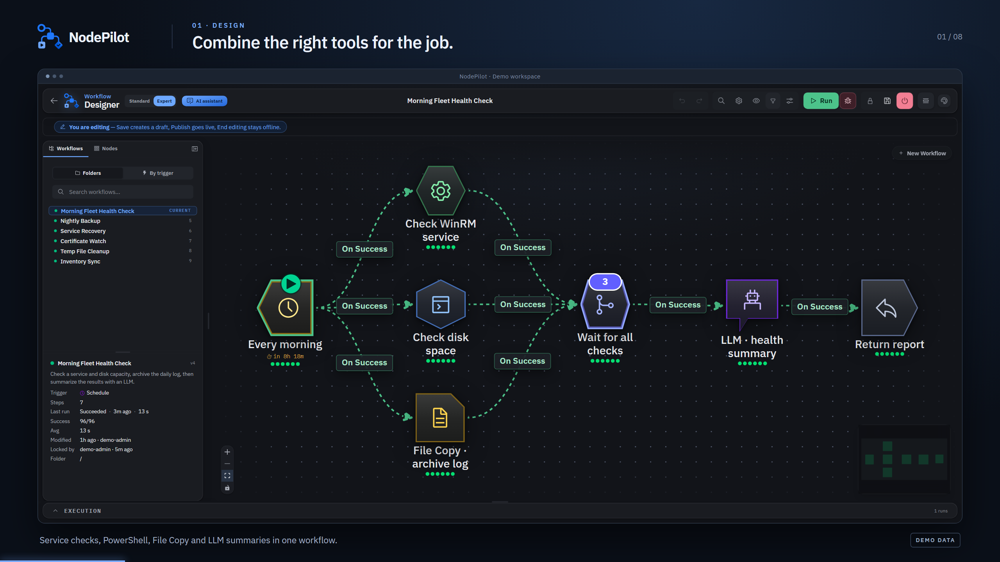

<div align="center">

# NodePilot

**Agentless Windows workflow orchestration, a modern, open replacement for Microsoft System Center Orchestrator.**

Multi-step automation is designed, scheduled, debugged and observed in the browser. PowerShell, file, registry and service operations, REST calls, SQL and further activities are executed across a Windows estate over WinRM, without agents on the targets.

[](https://github.com/Sev7eNup/NodePilot/actions/workflows/ci.yml)


[](https://github.com/Sev7eNup/NodePilot/releases/latest)
[](LICENSE)

**[🌐 Website](https://sev7enup.github.io/NodePilot/)** · **[▶️ Live demo](https://sev7enup.github.io/NodePilot/demo/)** · **[📚 Documentation](https://sev7enup.github.io/NodePilot/docs/)** · **[⬇️ Download](https://github.com/Sev7eNup/NodePilot/releases/latest)** · **[🚀 Install](https://sev7enup.github.io/NodePilot/docs/#/en/getting-started/installation)**

</div>

---

## Live demo

**[Open the live demo](https://sev7enup.github.io/NodePilot/demo/)** to try the actual web UI with sample data. It runs entirely in the browser, requires no installation and sends no data anywhere. Each visitor has a private copy, which resets on reload. Workflows can be built, published and run, while the canvas updates live.

It is the product's own frontend on an in-memory backend, so anything that genuinely needs a server (PowerShell on a host, a WinRM test, mail, a restore) reports that limitation instead of pretending.

## Product tour

[](https://sev7enup.github.io/NodePilot/media/nodepilot-product-tour.mp4)

**[Watch product video](https://sev7enup.github.io/NodePilot/media/nodepilot-product-tour.mp4)**

The video shows SCOrch import, the Workflow Designer, execution history, Live Ops, logs as well as AI chat in operation. English captions, no audio.

<details>
<summary><b>Browse screenshots</b></summary>

<details open>
<summary><b>🎨 Workflow Designer</b></summary>


</details>

<details>
<summary><b>📊 Dashboard</b></summary>


</details>

<details>
<summary><b>🛰️ Live-Ops Mission Control</b></summary>


</details>

<details>
<summary><b>🧾 Support Log, live tail</b></summary>


</details>

</details>

---

## Table of Contents

- [Product tour](#product-tour)
- [Why NodePilot](#why-nodepilot)
- [Coming from System Center Orchestrator](#coming-from-system-center-orchestrator)
- [Install, pick one of three paths](#install--pick-one-of-three-paths)
- [Documentation](#documentation)
- [Project Structure](#project-structure)
- [Testing](#testing)
- [Contributing](#contributing)
- [License](#license)

---

## Why NodePilot

NodePilot is a **drop-in modern alternative** for organizations that remain on legacy SCOrch. The agentless model and the target audience are the same (sysadmins automating Windows estates) but the product is built on a current stack with a user experience that does not resemble a 2010 MMC snap-in.

**Highlights**

- **SCOrch runbooks import directly**: native `.ois_export` XML, with activities, links, conditions, global variables as well as Published Data references translated into NodePilot's data bus. [How it works](#coming-from-system-center-orchestrator).
- **Visual designer**: a drag-and-drop canvas with 27 activity types, 6 triggers, typed nodes, a visual condition builder and a seven-cluster toolbar that places every editing affordance one click away.
- **True parallel engine**: an event-driven scheduling loop with real fan-out / fan-in, three junction modes (`waitAll` / `waitAny` / `waitNofM`), per-step DI scope and skip propagation.
- **Step debugger**: breakpoints, conditional breakpoints, step-over, a **live variable inspector** with **runtime overrides**, and **time-scrubbing replay** in the Gantt timeline.
- **Real-time UI**: SignalR streams step status, output and variables to every connected client while the workflow runs.
- **Agentless remote execution**: WinRM and the PowerShell SDK. Localhost runs in-process without WinRM.
- **AI-assisted authoring**: PowerShell scripts and entire workflows are generated from natural language. Generation works against OpenAI **or local Ollama / LM Studio / vLLM** for zero-egress setups.
- **Global AI chat**: a read-only assistant available from the bottom-right chat button and from its own page (`/ai-chat`), sharing conversations, drafts and ongoing answers across navigation. Answers use admin-switchable knowledge sources: documentation, operational data scoped by folder permissions, source code, and read-only SQL against the database. Every source is opt-in. The chat never executes or publishes anything.
- **Operations CLI (`np`)**: a full-featured command-line client covering login, run, watch, audit, lock/publish as well as import/export, published as a self-contained folder for `PATH`.
- **Drivable by AI agents**: an opt-in MCP server (`nodepilot-mcp`) exposes NodePilot to Claude Code, Claude Desktop and any other MCP client — 102 tools over 10 groups, HTTP-only against the same REST API, with destructive operations gated.
- **Batteries-included observability**: an opt-in OpenTelemetry and Prometheus exporter, plus a hardened, loopback-bound **Grafana stack with 10 pre-provisioned dashboards** (Mission Control, Workflows, Activities, WinRM, Triggers, API, Runtime, Security, AI, Database). Startup requires a unique `NODEPILOT_GRAFANA_ADMIN_PASSWORD`. Compose fails closed while the password is missing, rather than coming up on a default credential.
- **SCOrch-style edit lock**: an atomic per-user check-out and publish flow, `423 Locked` enforced by every mutating endpoint, force-unlock for admins with audit trail.
- **Workflow versioning**: every edit is snapshotted, rollback takes one click, and any two versions can be compared visually.
- **JWT and RBAC**: Admin / Operator / Viewer roles, BCrypt passwords, account lockout, DPAPI-encrypted credentials, output redaction, SSRF guards, per-IP rate limits, and an `audit-event` alert source that pages on failed logins, lockouts, break-glass sign-ins and privilege changes without a SIEM.
- **AD SSO Preview (opt-in)**: hardened LDAP/Kerberos, OIDC and SCIM, server-side sessions as well as directory-backed RBAC complement Active/Passive **HA**, secret providers and **ECS-JSON SIEM** logging. Production status remains Preview until the real AD/Kerberos/LDAPS field gate passes. See [docs/enterprise-features.md](docs/enterprise-features.md).
- **Production-grade deployment**: a turnkey PowerShell installer for a Windows Service under a **gMSA**, direct Kestrel HTTPS, install/data-dir split, and in-place upgrades with auto-rollback.

---

## Coming from System Center Orchestrator

SCOrch is not going anywhere. [System Center 2025 Orchestrator](https://learn.microsoft.com/en-us/lifecycle/products/system-center-2025-orchestrator) shipped in November 2024 with mainstream support to January 2030 and extended support to January 2035. An existing installation is therefore not on a deadline, and this section is not a migration pitch.

What has not moved is authoring. The web console added in 2022 runs and monitors runbooks. It cannot build them. Writing one still requires the desktop Runbook Designer on a machine with the client installed, and once it is written there is no version history, no diff between two states and no rollback. NodePilot is built for that gap: the same agentless model, the same job, the same people, with the editor, the debugger and the version history in a browser.

**Existing runbooks come across.** NodePilot reads SCOrch's native `.ois_export` XML directly (exports from 2012, 2016 and 2019 all parse) and turns runbooks into workflows:

- **Activities are mapped, not dropped.** Roughly forty SCOrch type names translate directly: scripts and programs, the file, folder, archive and text-file activities, *Query XML*, *Query Database*, *Query WMI*, *Invoke Web Services*, *Send Email*, *Start/Stop Service*, *Restart System*, *Generate Random Text*, the *Monitor* activities that have a NodePilot trigger, as well as the Runbook Control set (*Initialize Data*, *Return Data*, *Junction*, and *Invoke Runbook*, which SCOrch writes as `Trigger Policy`) including the arguments passed to a child runbook.
- **Published Data becomes the data bus.** SCOrch's `` \`d.T.~Vb/{GUID}\`d.T.~Vb/ `` references are rewritten into NodePilot's `{{globals.Name}}` and `{{step.param.field}}` syntax, resolving through a readable name derived from each activity rather than a bare GUID. Where the two products name the same value differently the field is translated as well. Should SCOrch have published something for which NodePilot has no equivalent, the reference is reported instead of quietly pointing at the nearest-looking name. This is usually the part that makes a migration expensive.
- **Branches keep branching.** *Compare Values* becomes a `decision`, and the links that read its result are re-pointed at it. A comparison whose outcome nothing could read would leave every branch behind it dead.
- **Links, conditions and global variables come across**, including on-success and on-failure links, the `TRIGGERS` filter logic, and whether a link matched *all* or *any* of its filters.
- **Every runbook is runnable on arrival.** NodePilot starts a workflow from a trigger node, and a SCOrch runbook invoked by another needs no trigger of its own. One is therefore added and wired to the entry activities.
- **Nothing disappears silently.** An activity the importer cannot map becomes a *disabled* placeholder carrying the original type name and its full property list. A mapping that cannot fill a required setting degrades to one as well, rather than leaving a node that looks configured and does nothing. The import report names every lossy translation: a reference to a field the NodePilot activity does not publish, a reference across parallel branches (SCOrch's data bus is run-scoped, NodePilot's is ancestor-scoped), a remote step with no target machine, a dropped run-as account, an approximated schedule, and any link that ended up unconditional.
- **The folder tree comes across.** A SCOrch export carries the structure its console showed, for runbooks and for global variables, and the import rebuilds both below the chosen destination, reusing folders that are already there. Re-filing a few hundred workflows by hand is work a migration should not create.
- **The canvas resembles the original runbook.** SCOrch positions activities as small icons on a tight grid. NodePilot draws cards several times that size, so the coordinates cannot be copied as they are. The graph is scaled uniformly instead, a similarity transform, so every distance keeps its ratio and the arrangement is the one its author drew, only larger. Links are then made to read as curves rather than the angular loop the designer draws for an edge running backwards: a pair stacked in one column docks top-to-bottom without either node moving, and anything else is nudged apart horizontally. Rows are never touched. Should the arrangement not be reproducible (activities sharing a position, or spaced too tightly for any usable canvas) the import reports this and falls back to a left-to-right layout.

Import runs from the UI, from `POST /api/workflows/import-scorch`, or from the CLI:

```powershell
np workflow import-scorch --file .\runbooks.ois_export
```

The result is to be treated as a reviewed draft, not as a finished migration. Imported workflows arrive disabled, credentials are never reconstructed because SCOrch encrypts them, and anything the report flags needs a decision. After review, a workflow is activated explicitly through `POST /api/workflows/{id}/enable` or `np workflow enable <id>`. Both import APIs return the created ids, and the CLI exposes the same report as machine-readable stdout with `-o json`. The point is that a migration starts from actual runbooks instead of a blank canvas.

### How the two compare

| | System Center Orchestrator | NodePilot |
|---|---|---|
| **Support lifecycle** | System Center 2025: mainstream to 2030, extended to 2035 | rolling releases, no end-of-life date, and no vendor behind it either |
| **Agents on targets** | none (agentless) | none (agentless), same WinRM model |
| **Authoring** | desktop Runbook Designer only, the 2022 web console runs and monitors, but cannot build a runbook | browser, live canvas, real-time step status over SignalR |
| **Debugging** | Runbook Tester in the designer, breakpoints, step, published data per activity | the same in the real engine, plus conditional breakpoints, runtime variable overrides and time-scrubbing replay |
| **Parallelism** | parallel branches, junction waits for all or for any | event-driven fan-out/fan-in, three junction modes (`waitAll` / `waitAny` / `waitNofM`) |
| **Authoring assistance** | none | optional AI generation of scripts and whole workflows from natural language (local models supported) |
| **Automation API** | JSON web API since 2022, starts and monitors jobs | full REST API covering every operation, an `np` CLI, and an MCP server for AI agents |
| **Check-out / publish** | per-user check-out | the same model, kept deliberately, atomic lock/publish, `423 Locked` on every mutating endpoint, admin force-unlock with audit |
| **Versioning** | none built in | every edit snapshotted, visual diff, one-click rollback |
| **Observability** | job history in the database, shown in the console, no metrics or tracing | opt-in OpenTelemetry + Prometheus, 10 pre-provisioned Grafana dashboards |
| **Platform** | Windows Server | Windows Server *or* a single desktop machine (offline installer) |
| **Database** | SQL Server | PostgreSQL or SQL Server |
| **Licence** | commercial, per-managed-host | Apache-2.0, no per-host cost |
| **Support** | vendor | community, this is a single-maintainer open-source project |

The last row is the honest one. NodePilot provides the source, not a support contract, and is to be judged on that basis.

---

## Install, pick one of three paths

NodePilot runs in exactly three supported shapes. Pick the row that describes you. Each one is a complete route to a working login, and nothing below mixes them.

| | **1 · Desktop app** | **2 · Windows service** | **3 · From source** |
|---|---|---|---|
| **For** | one person, one machine | a team, a real server | contributors, evaluation |
| **You need** | Windows 11 x64, local admin | Windows Server 2022/2025, a TLS certificate, a prepared database | .NET 10 SDK, Node, a local PostgreSQL |
| **You get** | installer `.exe`: bundles a local PostgreSQL and the .NET runtime, installs both as services, opens a native window | setup `.exe` (or the signed `.zip` + PowerShell installer), Windows service under a gMSA, Kestrel HTTPS | `dotnet run` + Vite dev server on your own machine |
| **Database** | bundled, loopback-only | you provide it | you provide it |
| **Offline** | yes, fully | yes | no (package restore) |
| **Guide** | [below](#path-1--desktop-app) · [details](deploy/desktop/README.md) | [below](#path-2--windows-service) · [step-by-step](https://sev7enup.github.io/NodePilot/docs/#/en/deployment/production) | [below](#path-3--from-source) |

> NodePilot is **Windows-only by design**, the engine drives PowerShell remoting over WinRM and protects credentials with DPAPI. There is no Linux, container or Kubernetes target.

Every path ends the same way: the **first login creates the Admin account**, and it requires a one-time setup token. Where you find that token differs per path and is called out below.

---

### Path 1: Desktop app

A **local desktop application** for Windows 11 x64: one `.exe` that bundles the app, a self-contained .NET 10 runtime as well as a **local PostgreSQL** server, installs everything as background Windows services, and opens a native **Electron** window on top. It is fully **offline**, with no runtime prerequisites and no external database.

`NodePilot-Desktop-Setup-<version>.exe` is downloaded from the [latest release](https://github.com/Sev7eNup/NodePilot/releases/latest) and run. The installer requires local admin: it provisions the database cluster, a loopback certificate and both services, then launches the shell and hands the first-run setup token straight to the login screen. No file has to be located manually. Should provisioning fail, the installer reports this and names its log, rather than finishing green with an app that will not start. When something does go wrong, [docs/desktop-troubleshooting.md](docs/desktop-troubleshooting.md) covers the log locations, first-run recovery and a complete removal. The full inventory of every log file (server and desktop, with paths, retention and which one to read when) is at [Logs & diagnostics](https://sev7enup.github.io/NodePilot/docs/#/en/deployment/logs).

The backend runs as an always-on service. This means that scheduled and webhook triggers keep firing while the window is closed. It uses the `Deployment:Mode=Desktop` posture: `Production`-hardened, but with a loopback-only Kestrel and a 127.0.0.1 Postgres. The Electron shell is a thin, hardened viewer that pins the loopback certificate by SHA-256 and trusts no system root CA.

<details>
<summary>Building the installer yourself</summary>

The build requires **.NET 10 SDK**, **Node**, **[Inno Setup 6](https://jrsoftware.org/isdl.php)** (`ISCC.exe`) as well as a **PostgreSQL 16 binaries folder**, the `pgsql` directory from the [EDB zip distribution](https://www.enterprisedb.com/download-postgresql-binaries). Should either of the last two be missing, the build fails fast. Expect 10–15 minutes.

```powershell
deploy\desktop\Build-DesktopInstaller.ps1 -PgBinariesPath 'C:\Packages\pgsql' -Version 1.2.0
# -> deploy\desktop\out\NodePilot-Desktop-Setup-1.2.0.exe
```

`Build-DesktopInstaller.ps1` never signs, it has no signing parameter at all. A signed installer is produced through the release build instead:

```powershell
deploy\Build-Artifact.ps1 -SigningCertificateThumbprint <artifact-signer> `
    -IncludeDesktopInstaller -PgBinariesPath 'C:\Packages\pgsql' `
    -InstallerSigningCertificateThumbprint <authenticode-signer>
```

Signing belongs in the build rather than afterwards, because signing rewrites the `.exe` and would invalidate its entry in `NodePilot-<version>.SHA256SUMS.txt`. Signing does not silence SmartScreen. A downloaded installer warns on first launch either way, since the publisher certificate is self-signed and carries no reputation (see [deployment-guide.md](docs/deployment-guide.md#first-run-the-smartscreen-prompt)). Internals, service identities and the first-run handoff are documented in [`deploy/desktop/README.md`](deploy/desktop/README.md).

</details>

---

### Path 2: Windows service

The production rollout consists of a signed artifact plus a PowerShell installer that registers NodePilot as a Windows service under a **gMSA**, terminates HTTPS in Kestrel directly, and splits install and data directories so that in-place upgrades can roll back.

**Prerequisites** (all enforced by the installer's pre-flight, which fails with a named error):

- **Windows Server 2022 or 2025**, domain-joined for the gMSA path, `-UseLocalSystem` works without a domain
- **.NET Runtime and ASP.NET Core Runtime, 10.0.11 or newer in the 10.x line, both x64** — two downloads, and both are needed: the ASP.NET Core package carries only `Microsoft.AspNetCore.App` and no `dotnet.exe`, so on a machine without .NET it leaves a framework nothing can load. **Not** the Hosting Bundle, which wires up IIS and restarts W3SVC. NodePilot ships as `win-x64`. A 32-bit runtime cannot host it, and the pre-flight reports this rather than passing the row
- **PostgreSQL 16+** or **SQL Server 2022 CU1+** (build ≥ 16.0.4003.1, earlier builds cannot serve the `Encrypt=Strict` / TDS 8.0 connections NodePilot opens, and are rejected)
- a **TLS certificate** in `Cert:\LocalMachine\My` with its private key
- **antivirus exclusions** agreed with the security team. See [docs/av-exclusions.md](docs/av-exclusions.md)

There are two ways to run it, and they install the same thing.

**With the wizard.** `NodePilot-Server-Setup-<version>.exe` is downloaded from the [latest release](https://github.com/Sev7eNup/NodePilot/releases/latest) and run. It carries the signed artifact and both .NET runtimes, checks every prerequisite above *before* changing anything (showing each as green, amber or red with a copyable fix) and can install the runtime, create the SQL login and database, or issue a lab certificate. One file instead of five, and no manual thumbprint comparison. Unattended: `Setup.exe /VERYSILENT /SUPPRESSMSGBOXES /ANSWERFILE=answers.json`. Details, answer-file schema and switches are documented in [deploy/server/README.md](deploy/server/README.md).

**With the scripts**, which is what the wizard runs and what automation should use. The signed `NodePilot-<version>.zip` is downloaded together with its `.manifest.json` and `.manifest.json.p7s`, verified against `NodePilot-<version>.SHA256SUMS.txt`, and then installed:

```powershell
.\deploy\Install-NodePilot.ps1 `
    -ArtifactPath 'C:\Packages\NodePilot-1.2.0.zip' `
    -TrustedArtifactSignerThumbprint '<publisher thumbprint from the release notes>' `
    -CertThumbprint '<your TLS cert thumbprint>' `
    -ServiceAccount 'CONTOSO\svc-nodepilot$' `
    -PublicHostname 'nodepilot.corp.example.com'
```

The installer **refuses unsigned or tampered artifacts**. `-TrustedArtifactSignerThumbprint` is mandatory, and the signature, the signer's identity, its code-signing eligibility as well as its validity are all verified, not just the hash. It does **not** require the publisher to be trusted on the target machine: pinning the thumbprint is the trust decision, so there is nothing to import before installing. If you build the artifact yourself you also sign it yourself, `docs/deployment-guide.md` walks through creating the self-signed code-signing certificate.

**Full walkthrough** covering service identity, database, certificates and first login: [Windows Server deployment](https://sev7enup.github.io/NodePilot/docs/#/en/deployment/production). **Verifying what you downloaded, and building it yourself**, plus a troubleshooting table for what actually goes wrong: [docs/deployment-guide.md](docs/deployment-guide.md). **Operator reference**, every parameter, update and uninstall: [deploy/README.md](deploy/README.md).

---

### Path 3: From source

For contributors and for evaluation on a workstation.

**Prerequisites**

- **Windows 10 / 11**, or a Windows Server. This path is not picky and only requires Windows
- **.NET 10 SDK**: [download](https://dotnet.microsoft.com/download). The exact band is pinned in [`global.json`](global.json)
- **Node.js**: the minimum is declared in each `package.json` `engines` field (react-router 8 sets it), `npm` warns below it
- **PostgreSQL 16+**: or SQL Server 2022 CU1+ with `Database:Provider: sqlserver`

**1. Create the database**

Neither shipped connection string carries a password, so this step is not optional.

```powershell
winget install PostgreSQL.PostgreSQL
$psql = "C:\Program Files\PostgreSQL\16\bin\psql.exe"
& $psql -U postgres -c "CREATE ROLE nodepilot WITH LOGIN PASSWORD 'ChangeMe!';"
& $psql -U postgres -c "CREATE DATABASE nodepilot OWNER nodepilot;"
```

**2. Start the backend (port 5000)**

The password is passed through the environment rather than into a tracked file, so that it never becomes a commit:

```powershell
$env:ConnectionStrings__Postgres = "Host=127.0.0.1;Port=5432;Database=nodepilot;Username=nodepilot;Password=ChangeMe!;SSL Mode=Disable"
cd src\NodePilot.Api
dotnet run
```

PostgreSQL is started **before** the API. Without a reachable database the process exits during the migration bootstrap and reports which server and database it could not reach.

On first start NodePilot writes a one-time setup token to `admin-setup.token` **next to the project**, `src\NodePilot.Api\admin-setup.token`, in the content root rather than the directory the process was started from. Sign-in uses the intended admin username and password. The login screen reveals a **Setup token** field on the first attempt, and pasting the token creates the Admin account.

**3. Start the frontend (port 5173)**

```powershell
cd src\nodepilot-ui
npm install
npm run dev
```

<http://localhost:5173> serves the app, the Vite dev server proxies `/api`, `/healthz` and `/hubs` to port 5000.

**4. (optional) Bring up Grafana**

```powershell
cd grafana
Copy-Item .env.example .env     # then set NODEPILOT_GRAFANA_ADMIN_PASSWORD - compose refuses to start without it
docker compose up -d
# Grafana    -> http://localhost:3000   (user "admin", the password you just set)
# Prometheus -> http://localhost:9090
```

The Prometheus exporter is then enabled on the API. All three variables are required. The third is what lets Prometheus scrape `/metrics` without credentials:

```powershell
$env:OpenTelemetry__Enabled = "true"
$env:OpenTelemetry__Exporters__PrometheusScrape = "true"
$env:OpenTelemetry__Exporters__PrometheusScrapeAllowAnonymous = "true"
```

See [grafana/README.md](grafana/README.md) for the full walk-through.

The same walkthrough, with more detail per step, lives on the documentation site, in [English](https://sev7enup.github.io/NodePilot/docs/#/en/getting-started/installation) and [German](https://sev7enup.github.io/NodePilot/docs/#/de/getting-started/installation).

---

### Example workflow

Want to see the designer without building anything? The bundled showcase is a nightly fleet health-check that fans out three parallel probes, gathers them at a junction, and routes a decision to an alert or an all-green log:

```
scripts/readme-showcase-workflow.json
```

Import runs via the **Workflows** page → *Import*, or through `POST /api/workflows/import`. It exercises every shape that occurs in production: schedule trigger, `runScript`, `log`, `junction` (waitAll), `decision`, `emailNotification`, `returnData`, as well as three phase sticky-notes, laid out to fill the canvas width and run top-to-bottom.

---

## Documentation

Everything below the surface lives on the **[documentation site](https://sev7enup.github.io/NodePilot/docs/)**, 44 pages in English and German, with search and deep links. This README deliberately stops at "installed and logged in".

| | |
|---|---|
| **Start here** | [Introduction](https://sev7enup.github.io/NodePilot/docs/#/en/getting-started/introduction) · [Installation](https://sev7enup.github.io/NodePilot/docs/#/en/getting-started/installation) · [Architecture](https://sev7enup.github.io/NodePilot/docs/#/en/getting-started/architecture) |
| **Building workflows** | [Workflows & activities](https://sev7enup.github.io/NodePilot/docs/#/en/concepts/workflows) · [Data bus & variables](https://sev7enup.github.io/NodePilot/docs/#/en/concepts/data-bus) · [Edge conditions](https://sev7enup.github.io/NodePilot/docs/#/en/concepts/edge-conditions) · [Sub-workflows](https://sev7enup.github.io/NodePilot/docs/#/en/concepts/sub-workflows) |
| **The designer** | [Overview](https://sev7enup.github.io/NodePilot/docs/#/en/designer/overview) · [Canvas, nodes & edges](https://sev7enup.github.io/NodePilot/docs/#/en/designer/canvas-nodes-edges) · [Properties, modes & shortcuts](https://sev7enup.github.io/NodePilot/docs/#/en/designer/properties-modes) |
| **Reference** | [All 27 activities](https://sev7enup.github.io/NodePilot/docs/#/en/activities-reference) · [Triggers](https://sev7enup.github.io/NodePilot/docs/#/en/triggers) · [API endpoints](https://sev7enup.github.io/NodePilot/docs/#/en/api/endpoints) · [`np` CLI](https://sev7enup.github.io/NodePilot/docs/#/en/cli) · [MCP server](https://sev7enup.github.io/NodePilot/docs/#/en/mcp-server) |
| **Running it** | [Windows Server](https://sev7enup.github.io/NodePilot/docs/#/en/deployment/production) · [Desktop app](https://sev7enup.github.io/NodePilot/docs/#/en/deployment/desktop) · [Antivirus exclusions](https://sev7enup.github.io/NodePilot/docs/#/en/deployment/av-exclusions) · [Logs & diagnostics](https://sev7enup.github.io/NodePilot/docs/#/en/deployment/logs) · [Configuration](https://sev7enup.github.io/NodePilot/docs/#/en/configuration/appsettings) |
| **Security** | [Security model](https://sev7enup.github.io/NodePilot/docs/#/en/security/overview) · [Hardening flags](https://sev7enup.github.io/NodePilot/docs/#/en/security/hardening) · [Audit log](https://sev7enup.github.io/NodePilot/docs/#/en/security/audit-log) |
| **Enterprise** | [High availability](https://sev7enup.github.io/NodePilot/docs/#/en/enterprise/high-availability) · [Secret providers](https://sev7enup.github.io/NodePilot/docs/#/en/enterprise/secrets-providers) · [AD SSO Preview](https://sev7enup.github.io/NodePilot/docs/#/en/enterprise/ldap-windows-sso) · [Folder RBAC](https://sev7enup.github.io/NodePilot/docs/#/en/enterprise/folder-rbac) |

The API also documents itself. The OpenAPI spec is served at `GET /openapi/v1.json`, with Swagger UI at `GET /swagger`, in Development by default.

### Production deployment

A real server rollout follows **[Windows Server deployment](https://sev7enup.github.io/NodePilot/docs/#/en/deployment/production)** on the documentation site, a lab-validated walkthrough covering service identity, both database providers, certificates and the first admin account. The installer runs NodePilot as a Windows service under a gMSA with direct Kestrel HTTPS, splits install and data directories, and upgrades in place with automatic rollback.

Two companions belong to it. [docs/deployment-guide.md](docs/deployment-guide.md) covers what happens *before* installation (verifying the download against its checksums and publisher, and building the artifact in-house) and carries the troubleshooting table. [deploy/README.md](deploy/README.md) is the parameter reference, and states what the installer deliberately does *not* do.

Before a deployment into an environment with endpoint protection, [docs/av-exclusions.md](docs/av-exclusions.md) is to be handed to whoever owns it. NodePilot runs PowerShell by design, and that trips heuristics.

---

## Project Structure

```
src/
  NodePilot.Core/         Domain models, interfaces, enums (zero dependencies)
  NodePilot.Ai/           LLM stack: ILlmClient/OpenAI transport + SSRF guard, prompt catalog, script/workflow gen + chat assistant (Core-only; used by Api and Engine)
  NodePilot.Data/         EF Core DbContext, CredentialStore (DPAPI), provider-agnostic migrations
  NodePilot.Remote/       WinRM session factory + PowerShell SDK session
  NodePilot.Engine/       WorkflowEngine, 27 activities, RetryPolicy, DebugCoordinator
  NodePilot.Scheduler/    TriggerOrchestrator (Quartz.NET), 4 polling trigger sources + retention/cluster services
  NodePilot.Telemetry/    OpenTelemetry setup, Prometheus client, metric constants
  NodePilot.Api/          ASP.NET Core host, controllers, SignalR hub, security middleware
  NodePilot.Cli/          `np`: operations CLI (Spectre.Console.Cli), shipped in both installers under tools\np
  NodePilot.Mcp/          `nodepilot-mcp`: MCP server for AI agents (ModelContextProtocol), shipped under tools\mcp
  NodePilot.Switcher/     WPF utility for exclusive local NodePilot/SCOrch service control
  nodepilot-ui/           React 19 SPA (Vite 8 + Tailwind CSS 4 + React Flow 12)
  nodepilot-docs-ui/      Documentation website (Vite + React SPA): its OWN curated markdown corpus under content/{de,en}/, maintained alongside docs/ (not a 1:1 render)
  nodepilot-desktop/      Electron shell for the desktop app: thin hardened viewer, no business logic

tests/
  NodePilot.Engine.Tests/   xUnit: engine + every activity executor
  NodePilot.Ai.Tests/       xUnit: LLM client factory, endpoint guard, prompt catalog, gen/chat services
  NodePilot.Data.Tests/     xUnit: EF context + migrations
  NodePilot.Api.Tests/      xUnit: controllers, auth, telemetry, validation
  NodePilot.Cli.Tests/      xUnit + WireMock.Net: CLI ApiClient + DPAPI TokenStore
  NodePilot.Mcp.Tests/      xUnit + WireMock.Net: MCP tools + stdio-process smoke test
  NodePilot.LoadTests/      Standalone load harness (Console EXE, HdrHistogram)
  NodePilot.Switcher.Tests/ xUnit - discovery, state machine, fail-closed switching
  NodePilot.TestCommons/    Shared test infrastructure (TestDbFactory, FakeLlmClient, fixtures)

grafana/                  Docker-compose stack: Prometheus + Grafana + 10 dashboards
deploy/                   Production install / update / uninstall PowerShell scripts
docs/                     Feature docs (AI, styleguide, perf, security, deployment)
samples/                  Example workflows for the importer
```

**Dependency graph:**
`Api → Ai, Engine, Scheduler, Data, Remote, Core, Telemetry`
`Engine → Ai, Data, Remote, Core, Telemetry`
`Ai → Core` · `Data → Core` · `Remote → Core` · `Telemetry → Core`
`Cli → Core` · `Mcp → Core` *(HTTP-only, no backend project references)*

---

## Testing

Six CI jobs gate every pull request and every push to `main`: backend build and tests with an enforced **85 % line / 70 % branch** coverage gate, frontend lint/build/vitest, docs-site lint/tests/build, desktop-shell typecheck and tests, as well as hermetic Playwright E2E. A local nightly task runs the same four suites against the checked-out tree.

**Tests are mandatory.** Every behaviour change ships with tests in the same change. Which tests you run locally is scoped to what you touched. The full suite is CI's responsibility, not yours. Commands, the scoping rules and the guard-test mapping are documented in [CONTRIBUTING.md](CONTRIBUTING.md#build--test) and [CLAUDE.md](CLAUDE.md).

Two conventions are worth knowing beforehand: the WinRM remote layer is **always mocked**, and backend database tests run on **in-memory SQLite**, a test backend only, never a supported production provider.

---

## Contributing

Contributions are welcome. **[CONTRIBUTING.md](CONTRIBUTING.md)** has the full setup: prerequisites, how to obtain a local PostgreSQL and a first admin account, the build and test commands, as well as the conventions that CI enforces.

The short version:

1. **Open an issue first** for anything non-trivial, it saves a round of "we already explored that" review comments.
2. **Tests ship with the change**, not after it. CI fails without them.
3. **No backwards-compat shims.** NodePilot is greenfield, replace cleanly rather than keeping the old path alive behind a flag.
4. **Hand-built workflow JSON** requires [docs/workflow-styleguide.md](docs/workflow-styleguide.md) first, layout rules, edge-label conventions, and engine gotchas.

A security problem does not belong in a public issue. [SECURITY.md](SECURITY.md) has the private reporting path. Everyone taking part is expected to follow the [Code of Conduct](CODE_OF_CONDUCT.md).

`CLAUDE.md` is working notes for AI coding agents, not contributor documentation. It is checked in deliberately: NodePilot is built with agentic engineering, so the context an agent needs to work on this codebase belongs in the repository rather than in someone's private setup. What that does not change is the bar every change has to clear, behaviour changes ship with tests, and CI enforces the coverage gate on every pull request. [CONTRIBUTING.md](CONTRIBUTING.md) is the file written for people.

---

## License

NodePilot is licensed under the [Apache License 2.0](LICENSE). Use, modification and distribution are permitted, including commercially, provided that the copyright and license notices are retained. See [LICENSE](LICENSE) for the full text.

---

## Acknowledgments

- **System Center Orchestrator**: for proving that visual workflow orchestration on Windows is a real need, and for inspiring the per-user check-out / publish lifecycle.
- **[React Flow](https://reactflow.dev/)**: the canvas library underneath the designer.
- **[Quartz.NET](https://www.quartz-scheduler.net/)**: the cron engine behind `scheduleTrigger`.
- **[Serilog](https://serilog.net/)**: structured logging across the stack.
- **[OpenTelemetry](https://opentelemetry.io/)**: vendor-neutral traces & metrics.
- **[Spectre.Console](https://spectreconsole.net/)**: the CLI presentation layer.

---

## Further Reading

- **[📚 sev7enup.github.io/NodePilot/docs](https://sev7enup.github.io/NodePilot/docs/)**, the documentation website. 44 pages in English and German, with search, sidebar navigation and light/dark themes. Start at [Introduction](https://sev7enup.github.io/NodePilot/docs/#/en/getting-started/introduction) or jump to [Installation](https://sev7enup.github.io/NodePilot/docs/#/en/getting-started/installation). **The same site ships with the product**, every installation serves it at `/docs`, without a login and without internet access, at the version actually installed.
- **[CLAUDE.md](CLAUDE.md)**: architecture conventions, full activity/trigger reference, variable resolution details, edge-condition grammar, test guidelines, and the complete API endpoint table.
- **[src/nodepilot-docs-ui/](src/nodepilot-docs-ui/)**: standalone documentation website (Vite + React SPA) with client-side search, sidebar navigation, light/dark theme, and **English/German** via i18next (the language lives in the route: `#/en/…`, `#/de/…`). Note: it ships its own curated markdown corpus under `content/en/` and `content/de/`, changes to `docs/` must be mirrored there deliberately, since it is not a 1:1 render, and both languages must be kept in step or the parity test fails. It has two deployments: GitHub Pages, which publishes the project website at the site root and the documentation under `/docs/`, and `wwwroot/docs` inside the server artifact and desktop package, which the API serves at `/docs`. The project website (`src/site/`, English and German) is a separate build that only goes to GitHub Pages. The product ships the documentation alone.
- **[docs/workflow-designer-features.md](docs/workflow-designer-features.md)**: complete feature inventory of the workflow designer (canvas, nodes, edges, properties, overlays, modes, shortcuts, mobile), organized by area.
- **[docs/workflow-styleguide.md](docs/workflow-styleguide.md)**: layout rules, edge-label conventions, and engine gotchas for hand-built workflow JSON.
- **[docs/ai-features.md](docs/ai-features.md)**: LLM configuration, recommended models, security model, error taxonomy.
- **[docs/performance-improvements.md](docs/performance-improvements.md)**: capacity tuning playbook (parallel workflow targets, runspace pools, DB pool sizing).
- **[docs/security-findings.md](docs/security-findings.md)**: register of resolved security findings with fix and test, by severity.
- **[docs/av-exclusions.md](docs/av-exclusions.md)**: antivirus/EDR exclusions for the server and desktop roles (folders, processes, temp-file patterns, behaviour rules), each with its rationale and residual risk. It is written to be handed to a security team.
- **[docs/enterprise-features.md](docs/enterprise-features.md)**: enterprise features, configuration switches and release gates, including the current AD SSO Preview.
- **[docs/ha-active-passive.md](docs/ha-active-passive.md)**: Active/Passive HA setup, lease/fencing model, failover RTO.
- **[docs/secrets-providers.md](docs/secrets-providers.md)**: secret-provider operator runbook (DPAPI ↔ AES-GCM migration).
- **[docs/ldap-windows-sso.md](docs/ldap-windows-sso.md)**: LDAPS, Windows Negotiate/Kerberos, OIDC and SCIM setup and field-test checklist.
- **[docs/roadmap.md](docs/roadmap.md)**, the roadmap. What is committed, what is trigger-gated, what was deliberately ruled out and why.
- **[grafana/README.md](grafana/README.md)**: Prometheus + Grafana stack walk-through.
- **[deploy/README.md](deploy/README.md)**: production deployment operator manual (Windows Service, external DB).
- **[docs/switcher.md](docs/switcher.md)**: local NodePilot/System Center switcher behavior and safety model.
- **[deploy/desktop/README.md](deploy/desktop/README.md)**, desktop app. Offline one-click installer with bundled PostgreSQL, plus the fast dev loop for iterating without rebuilding the installer.
- **[docs/desktop-troubleshooting.md](docs/desktop-troubleshooting.md)**, desktop app troubleshooting. Log locations, first-run setup recovery, port conflicts, and how to remove it completely.
