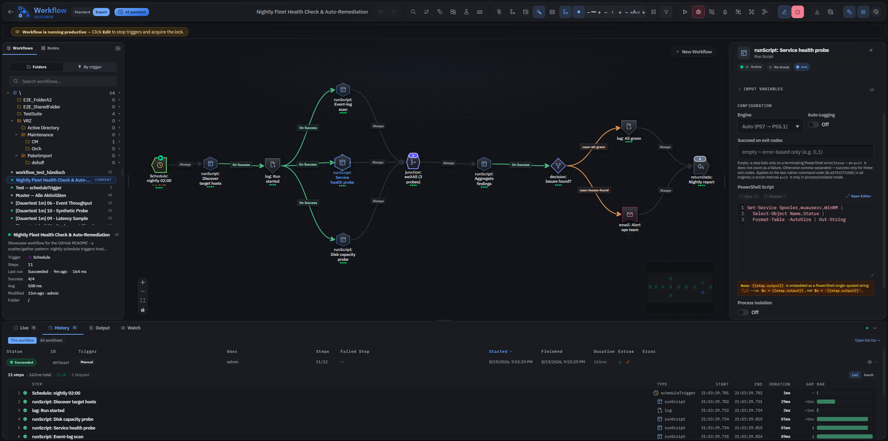
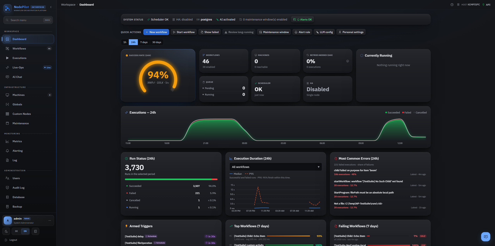
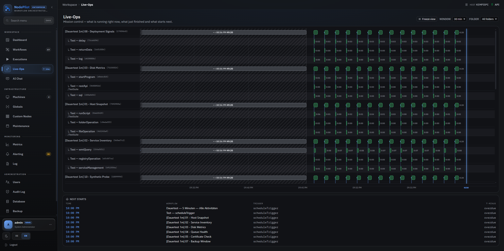
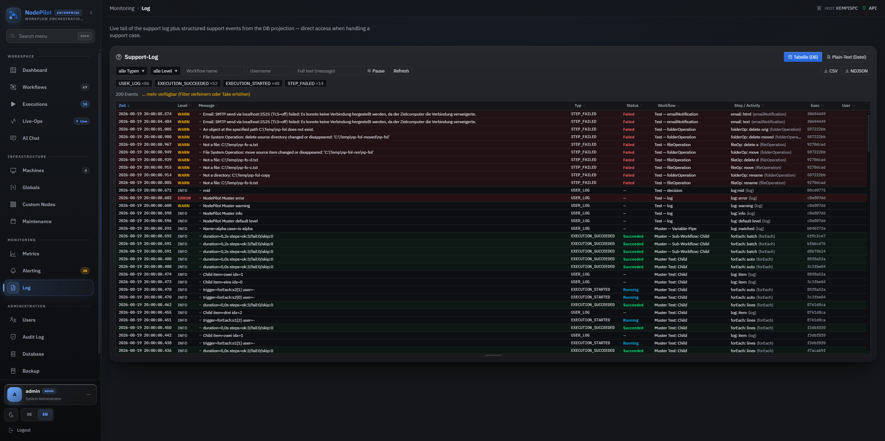

<div align="center">

# NodePilot

**Agentless Windows workflow orchestration — a modern, open replacement for Microsoft System Center Orchestrator.**

Design, schedule, debug, and observe multi-step automation in your browser. Run PowerShell, file/registry/service operations, REST calls, SQL, and more across your Windows estate over WinRM — no agents on the targets.

[](https://github.com/Sev7eNup/NodePilot/actions/workflows/ci.yml)


[](https://github.com/Sev7eNup/NodePilot/releases/latest)
[](LICENSE)

**[📚 Documentation](https://sev7enup.github.io/NodePilot/)** · **[⬇️ Download](https://github.com/Sev7eNup/NodePilot/releases/latest)** · **[🚀 Install](https://sev7enup.github.io/NodePilot/#/en/getting-started/installation)**

</div>

---

## Screenshots

<details open>
<summary><b>🎨 Workflow Designer</b></summary>



</details>

<details>
<summary><b>📊 Dashboard</b></summary>



</details>

<details>
<summary><b>🛰️ Live-Ops Mission Control</b></summary>



</details>

<details>
<summary><b>🧾 Support Log — live tail</b></summary>



</details>

---

## Table of Contents

- [Why NodePilot](#why-nodepilot)
- [Coming from System Center Orchestrator](#coming-from-system-center-orchestrator)
- [Install — pick one of three paths](#install--pick-one-of-three-paths)
- [Documentation](#documentation)
- [Project Structure](#project-structure)
- [Testing](#testing)
- [Contributing](#contributing)
- [License](#license)

---

## Why NodePilot

NodePilot is a **drop-in modern alternative** for organizations stuck on legacy SCOrch — same agentless model, same target audience (sysadmins automating Windows estates), but built on a current stack with a UX that doesn't feel like a 2010 MMC snap-in.

**Highlights**

- **Your SCOrch runbooks import directly** — native `.ois_export` XML, with activities, links, conditions, global variables and Published Data references translated into NodePilot's data bus. [How it works](#coming-from-system-center-orchestrator).
- **Visual designer** — drag-and-drop canvas with 27 activity types, 6 triggers, typed nodes, a visual condition builder, and a seven-cluster toolbar that puts every editing affordance one click away.
- **True parallel engine** — event-driven scheduling loop with real fan-out / fan-in, three junction modes (`waitAll` / `waitAny` / `waitNofM`), per-step DI scope, and skip propagation.
- **Step debugger** — breakpoints, conditional breakpoints, step-over, **live variable inspector** with **runtime overrides**, and **time-scrubbing replay** in the Gantt timeline.
- **Real-time UI** — SignalR streams step status, output, and variables to every connected client as the workflow runs.
- **Agentless remote execution** — WinRM + PowerShell SDK; localhost runs in-process without WinRM.
- **AI-assisted authoring** — generate PowerShell scripts and entire workflows from natural language; works against OpenAI **or local Ollama / LM Studio / vLLM** for zero-egress setups.
- **Global AI chat** — a read-only assistant on its own page (`/ai-chat`) that answers from admin-switchable knowledge sources: the documentation, operational data scoped by folder permissions, the source code, and read-only SQL against the database. Every source is opt-in; the chat never executes or publishes anything.
- **Operations CLI (`np`)** — full-featured command-line client (login, run, watch, audit, lock/publish, import/export), published as a self-contained folder you put on `PATH`.
- **Drivable by AI agents** — an opt-in MCP server (`nodepilot-mcp`) exposes NodePilot to Claude Code, Claude Desktop and any other MCP client — 100 tools over 10 groups, HTTP-only against the same REST API, with destructive operations gated.
- **Batteries-included observability** — opt-in OpenTelemetry + Prometheus exporter, plus a hardened, loopback-bound **Grafana stack with 10 pre-provisioned dashboards** (Mission Control, Workflows, Activities, WinRM, Triggers, API, Runtime, Security, AI, Database). Startup requires a unique `NODEPILOT_GRAFANA_ADMIN_PASSWORD` — Compose fails closed while the password is missing, rather than coming up on a default credential.
- **SCOrch-style edit lock** — atomic per-user check-out / publish flow, `423 Locked` enforced by every mutating endpoint, force-unlock for admins with audit trail.
- **Workflow versioning** — every edit is snapshotted; one-click rollback; visual diff between any two versions.
- **JWT + RBAC** — Admin / Operator / Viewer roles, BCrypt passwords, account lockout, DPAPI-encrypted credentials, output redaction, SSRF guards, per-IP rate limits.
- **AD SSO Preview (opt-in)** — hardened LDAP/Kerberos, OIDC + SCIM, server-side sessions and directory-backed RBAC complement Active/Passive **HA**, secret providers and **ECS-JSON SIEM** logging. Production status remains Preview until the real AD/Kerberos/LDAPS field gate passes. See [docs/enterprise-features.md](docs/enterprise-features.md).
- **Production-grade deployment** — turnkey PowerShell installer for Windows Service under a **gMSA**, direct Kestrel HTTPS, install/data-dir split, in-place upgrades with auto-rollback.

---

## Coming from System Center Orchestrator

SCOrch went out of mainstream support and its successor story is "rewrite everything in something
else". NodePilot is built for the case that leaves behind: the same agentless model, the same job,
the same people — on a stack that is still maintained.

**Your runbooks come with you.** NodePilot reads SCOrch's native `.ois_export` XML directly
(exports from 2012, 2016 and 2019 all parse) and turns runbooks into workflows:

- **Activities are mapped, not dropped.** Roughly forty SCOrch type names translate directly —
  scripts and programs, the file, folder, archive and text-file activities, *Query XML*, *Query
  Database*, *Query WMI*, *Invoke Web Services*, *Send Email*, *Start/Stop Service*, *Restart
  System*, *Generate Random Text*, the *Monitor* activities that have a NodePilot trigger, and the
  Runbook Control set (*Initialize Data*, *Return Data*, *Junction*, and *Invoke Runbook*, which
  SCOrch writes as `Trigger Policy`) including the arguments passed to a child runbook.
- **Published Data becomes the data bus.** SCOrch's `` \`d.T.~Vb/{GUID}\`d.T.~Vb/ `` references are
  rewritten into NodePilot's `{{globals.Name}}` and `{{step.param.field}}` syntax, resolving through
  a readable name derived from each activity rather than a bare GUID. Where the two products name
  the same value differently the field is translated too, and where SCOrch published something
  NodePilot has no equivalent for, the reference is reported instead of quietly pointing at the
  nearest-looking name. This is usually the part that makes a migration expensive.
- **Branches keep branching.** *Compare Values* becomes a `decision`, and the links that read its
  result are re-pointed at it — a comparison whose outcome nothing could read would leave every
  branch behind it dead.
- **Links, conditions and global variables come across**, including on-success / on-failure links,
  the `TRIGGERS` filter logic, and whether a link matched *all* or *any* of its filters.
- **Every runbook is runnable on arrival.** NodePilot starts a workflow from a trigger node, and a
  SCOrch runbook invoked by another needs no trigger of its own — so one is added and wired to the
  entry activities.
- **Nothing disappears silently.** An activity the importer cannot map becomes a *disabled*
  placeholder carrying the original type name and its full property list; a mapping that cannot
  fill a required setting degrades to one too, rather than leaving a node that looks configured and
  does nothing. The import report names every lossy translation: a reference to a field the
  NodePilot activity does not publish, a reference across parallel branches (SCOrch's data bus is
  run-scoped, NodePilot's is ancestor-scoped), a remote step with no target machine, a dropped
  run-as account, an approximated schedule, and any link that ended up unconditional.
- **Your folder tree comes with you.** A SCOrch export carries the structure its console showed —
  for runbooks and for global variables — and the import rebuilds both below the destination you
  pick, reusing folders that are already there. Re-filing a few hundred workflows by hand is work a
  migration should not create.
- **The canvas looks like your runbook.** SCOrch positions activities as small icons on a tight
  grid; NodePilot draws cards several times that size, so the coordinates cannot be copied as they
  are. The graph is scaled uniformly instead — a similarity transform, so every distance keeps its
  ratio and the arrangement is the one its author drew, just larger. Links are then made to read as
  curves rather than the angular loop the designer draws for an edge running backwards: a pair
  stacked in one column docks top-to-bottom without either node moving, and anything else is nudged
  apart horizontally. Rows are never touched. Where the arrangement cannot be reproduced (activities
  sharing a position, or spaced too tightly for any usable canvas) the import says so and falls back
  to a left-to-right layout.

Import from the UI, from `POST /api/workflows/import-scorch`, or from the CLI:

```powershell
np workflow import-scorch --file .\runbooks.ois_export
```

Treat the result as a reviewed draft, not a finished migration. Imported workflows arrive disabled,
credentials are never reconstructed (SCOrch encrypts them), and anything the report flags needs a
decision. The point is that you start from your actual runbooks instead of a blank canvas.

### How the two compare

| | System Center Orchestrator | NodePilot |
|---|---|---|
| **Agents on targets** | none (agentless) | none (agentless) — same WinRM model |
| **Designer** | Windows MMC-era desktop client | browser, live canvas, real-time step status over SignalR |
| **Debugging** | run and read the log | breakpoints, step-over, live variable inspector with runtime overrides, time-scrubbing replay |
| **Parallelism** | limited | event-driven fan-out/fan-in, three junction modes (`waitAll` / `waitAny` / `waitNofM`) |
| **Runbook authoring** | manual | manual, plus optional AI generation from natural language (local models supported) |
| **Automation API** | limited web service | full REST API, an `np` CLI, and an MCP server for AI agents |
| **Check-out / publish** | per-user check-out | same model, kept deliberately — atomic lock/publish, `423 Locked` on every mutating endpoint, admin force-unlock with audit |
| **Versioning** | none built in | every edit snapshotted, visual diff, one-click rollback |
| **Observability** | none built in | opt-in OpenTelemetry + Prometheus, 10 pre-provisioned Grafana dashboards |
| **Platform** | Windows Server | Windows Server *or* a single desktop machine (offline installer) |
| **Database** | SQL Server | PostgreSQL or SQL Server |
| **Licence** | commercial, per-managed-host | Apache-2.0, no per-host cost |
| **Support** | vendor | community — this is a single-maintainer open-source project |

The last row is the honest one: NodePilot gives you the source, not a support contract. Judge it
on that basis.

**Need to make the case to someone else?** Two ready-made slide decks live in
[`presentations/`](presentations/), both self-contained HTML — download and open in a browser:

- **[NodePilot vs. System Center Orchestrator 2022](presentations/nodepilot-management-presentation.html)**
  (11 slides) — the decision case: starting position, architecture and footprint, operation and UX,
  cost.
- **[NodePilot — technical deck](presentations/nodepilot-presentation.html)** (39 slides) — overall
  architecture, the activity model, migrating from SCOrch, operational practice.

Both decks are in **German**. They predate this README and are not maintained in step with it —
treat them as a starting point for your own slides rather than as current reference material.

---

## Install — pick one of three paths

NodePilot runs in exactly three supported shapes. Pick the row that describes you; each one is a
complete route to a working login, and nothing below mixes them.

| | **1 · Desktop app** | **2 · Windows service** | **3 · From source** |
|---|---|---|---|
| **For** | one person, one machine | a team, a real server | contributors, evaluation |
| **You need** | Windows 11 x64, local admin | Windows Server 2022/2025, a TLS certificate, a prepared database | .NET 10 SDK, Node, a local PostgreSQL |
| **You get** | installer `.exe` — bundles a local PostgreSQL and the .NET runtime, installs both as services, opens a native window | setup `.exe` (or the signed `.zip` + PowerShell installer) — Windows service under a gMSA, Kestrel HTTPS | `dotnet run` + Vite dev server on your own machine |
| **Database** | bundled, loopback-only | you provide it | you provide it |
| **Offline** | yes, fully | yes | no (package restore) |
| **Guide** | [below](#path-1--desktop-app) · [details](deploy/desktop/README.md) | [below](#path-2--windows-service) · [step-by-step](https://sev7enup.github.io/NodePilot/#/en/deployment/production) | [below](#path-3--from-source) |

> NodePilot is **Windows-only by design** — the engine drives PowerShell remoting over WinRM and
> protects credentials with DPAPI. There is no Linux, container or Kubernetes target.

Every path ends the same way: the **first login creates the Admin account**, and it needs a
one-time setup token. Where to find that token differs per path and is called out below.

---

### Path 1 — Desktop app

A **local desktop application** for Windows 11 x64: one `.exe` that bundles the app, a
self-contained .NET 10 runtime and a **local PostgreSQL** server, installs everything as background
Windows services, and opens a native **Electron** window on top — fully **offline**, no runtime
prerequisites, no external database.

Download `NodePilot-Desktop-Setup-<version>.exe` from the
[latest release](https://github.com/Sev7eNup/NodePilot/releases/latest) and run it. The installer
needs local admin: it provisions the database cluster, a loopback certificate and both services,
then launches the shell and hands the first-run setup token straight to the login screen — you
never have to find a file. If provisioning fails it says so and names its log, rather than
finishing green with an app that will not start. When something does go wrong,
[docs/desktop-troubleshooting.md](docs/desktop-troubleshooting.md) covers the log locations,
first-run recovery and a complete removal.

The backend runs as an always-on service, so scheduled and webhook triggers keep firing when the
window is closed. It uses the `Deployment:Mode=Desktop` posture: `Production`-hardened, but with a
loopback-only Kestrel and a 127.0.0.1 Postgres. The Electron shell is a thin, hardened viewer that
pins the loopback certificate by SHA-256 and trusts no system root CA.

<details>
<summary>Building the installer yourself</summary>

Needs **.NET 10 SDK**, **Node**, **[Inno Setup 6](https://jrsoftware.org/isdl.php)** (`ISCC.exe`)
and a **PostgreSQL 16 binaries folder** — the `pgsql` directory from the
[EDB zip distribution](https://www.enterprisedb.com/download-postgresql-binaries). The build fails
fast if either of the last two is missing. Expect 10–15 minutes.

```powershell
deploy\desktop\Build-DesktopInstaller.ps1 -PgBinariesPath 'C:\Packages\pgsql' -Version 1.2.0
# -> deploy\desktop\out\NodePilot-Desktop-Setup-1.2.0.exe
```

`Build-DesktopInstaller.ps1` never signs — it has no signing parameter at all. To get a signed
installer, build it through the release build instead:

```powershell
deploy\Build-Artifact.ps1 -SigningCertificateThumbprint <artifact-signer> `
    -IncludeDesktopInstaller -PgBinariesPath 'C:\Packages\pgsql' `
    -InstallerSigningCertificateThumbprint <authenticode-signer>
```

Sign during the build rather than afterwards: signing rewrites the `.exe` and would invalidate its
entry in `NodePilot-<version>.SHA256SUMS.txt`. Signing does not silence SmartScreen — a downloaded
installer warns on first launch either way, because the publisher certificate is self-signed and
carries no reputation (see
[deployment-guide.md](docs/deployment-guide.md#first-run-the-smartscreen-prompt)). Internals,
service identities and the first-run handoff: [`deploy/desktop/README.md`](deploy/desktop/README.md).

</details>

---

### Path 2 — Windows service

The production rollout: a signed artifact plus a PowerShell installer that registers NodePilot as a
Windows service under a **gMSA**, terminates HTTPS in Kestrel directly, and splits install and data
directories so in-place upgrades can roll back.

**Prerequisites** (all enforced by the installer's pre-flight, which fails with a named error):

- **Windows Server 2022 or 2025**, domain-joined for the gMSA path — `-UseLocalSystem` works
  without a domain
- **ASP.NET Core Runtime 10.0.11 or newer in the 10.x line (x64)** — the plain runtime, **not** the Hosting Bundle (that one
  wires up IIS and restarts W3SVC). NodePilot ships as `win-x64`; a 32-bit runtime cannot host it
  and the pre-flight says so rather than passing the row
- **PostgreSQL 16+** or **SQL Server 2022 CU1+** (build ≥ 16.0.4003.1 — earlier builds cannot serve
  the `Encrypt=Strict` / TDS 8.0 connections NodePilot opens, and are rejected)
- a **TLS certificate** in `Cert:\LocalMachine\My` with its private key
- **antivirus exclusions** agreed with your security team — see [docs/av-exclusions.md](docs/av-exclusions.md)

There are two ways to run it, and they install the same thing.

**With the wizard.** Download `NodePilot-Server-Setup-<version>.exe` from the
[latest release](https://github.com/Sev7eNup/NodePilot/releases/latest) and run it. It carries the
signed artifact and the ASP.NET Core runtime, checks every prerequisite above *before* changing
anything — showing each as green, amber or red with a copyable fix — and can install the runtime,
create the SQL login and database, or issue a lab certificate for you. One file instead of five,
and no manual thumbprint comparison. Unattended:
`Setup.exe /VERYSILENT /SUPPRESSMSGBOXES /ANSWERFILE=answers.json`. Details, answer-file schema and
switches: [deploy/server/README.md](deploy/server/README.md).

**With the scripts**, which is what the wizard runs and what you want for automation. Download the
signed `NodePilot-<version>.zip` together with its `.manifest.json` and `.manifest.json.p7s`,
verify it against `NodePilot-<version>.SHA256SUMS.txt`, then:

```powershell
.\deploy\Install-NodePilot.ps1 `
    -ArtifactPath 'C:\Packages\NodePilot-1.2.0.zip' `
    -TrustedArtifactSignerThumbprint '<publisher thumbprint from the release notes>' `
    -CertThumbprint '<your TLS cert thumbprint>' `
    -ServiceAccount 'CONTOSO\svc-nodepilot$' `
    -PublicHostname 'nodepilot.corp.example.com'
```

The installer **refuses unsigned or tampered artifacts** — `-TrustedArtifactSignerThumbprint` is
mandatory, and the signature, the signer's identity, its code-signing eligibility and its validity
are all verified, not just the hash. It does **not** require the publisher to be trusted on the
target machine: pinning the thumbprint is the trust decision, so there is nothing to import before
installing. If you build the artifact yourself you also sign it yourself;
`docs/deployment-guide.md` walks through creating the self-signed code-signing certificate.

**Full walkthrough** — service identity, database, certificates, first login:
[Windows Server deployment](https://sev7enup.github.io/NodePilot/#/en/deployment/production).
**Verifying what you downloaded, and building it yourself** — plus a troubleshooting table for
what actually goes wrong: [docs/deployment-guide.md](docs/deployment-guide.md). **Operator
reference** — every parameter, update and uninstall: [deploy/README.md](deploy/README.md).

---

### Path 3 — From source

For contributors and for evaluating on a workstation.

**Prerequisites**

- **Windows 10 / 11** (or a Windows Server — this path is not picky, it just needs Windows)
- **.NET 10 SDK** — [download](https://dotnet.microsoft.com/download); the exact band is pinned in [`global.json`](global.json)
- **Node.js** — the minimum is declared in each `package.json` `engines` field (react-router 8 sets it); `npm` warns if you are below it
- **PostgreSQL 16+** — or SQL Server 2022 CU1+ with `Database:Provider: sqlserver`

**1. Create the database**

Neither shipped connection string carries a password, so this step is not optional.

```powershell
winget install PostgreSQL.PostgreSQL
$psql = "C:\Program Files\PostgreSQL\16\bin\psql.exe"
& $psql -U postgres -c "CREATE ROLE nodepilot WITH LOGIN PASSWORD 'ChangeMe!';"
& $psql -U postgres -c "CREATE DATABASE nodepilot OWNER nodepilot;"
```

**2. Start the backend (port 5000)**

Pass the password through the environment rather than editing a tracked file — that way it never
becomes a commit:

```powershell
$env:ConnectionStrings__Postgres = "Host=127.0.0.1;Port=5432;Database=nodepilot;Username=nodepilot;Password=ChangeMe!;SSL Mode=Disable"
cd src\NodePilot.Api
dotnet run
```

Start PostgreSQL **before** the API — without a reachable database the process exits during the
migration bootstrap and tells you which server and database it could not reach.

On first start NodePilot writes a one-time setup token to `admin-setup.token` **next to the
project** (`src\NodePilot.Api\admin-setup.token` — it lands in the content root, not the directory
you started from). Sign in with the admin username and password you want; the login screen reveals
a **Setup token** field on the first attempt, and pasting the token creates the Admin account.

**3. Start the frontend (port 5173)**

```powershell
cd src\nodepilot-ui
npm install
npm run dev
```

Open <http://localhost:5173> — the Vite dev server proxies `/api`, `/healthz` and `/hubs` to
port 5000.

**4. (optional) Bring up Grafana**

```powershell
cd grafana
Copy-Item .env.example .env     # then set NODEPILOT_GRAFANA_ADMIN_PASSWORD - compose refuses to start without it
docker compose up -d
# Grafana    -> http://localhost:3000   (user "admin", the password you just set)
# Prometheus -> http://localhost:9090
```

Enable the Prometheus exporter on the API — all three variables are required, the third is what
lets Prometheus scrape `/metrics` without credentials:

```powershell
$env:OpenTelemetry__Enabled = "true"
$env:OpenTelemetry__Exporters__PrometheusScrape = "true"
$env:OpenTelemetry__Exporters__PrometheusScrapeAllowAnonymous = "true"
```

See [grafana/README.md](grafana/README.md) for the full walk-through.

The same walkthrough, with more detail per step, lives on the documentation site — in
[English](https://sev7enup.github.io/NodePilot/#/en/getting-started/installation) and
[German](https://sev7enup.github.io/NodePilot/#/de/getting-started/installation).

---

### Example workflow

Want to see the designer in action without building anything? Import the bundled
showcase — a nightly fleet health-check that fans out three parallel probes, gathers
them at a junction, and routes a decision to an alert or an all-green log:

```
scripts/readme-showcase-workflow.json
```

Import it via the **Workflows** page → *Import* (or `POST /api/import`). It exercises
every shape you'll meet in production — schedule trigger, `runScript`, `log`, `junction`
(waitAll), `decision`, `emailNotification`, `returnData`, plus three phase sticky-notes —
laid out to fill the canvas width and run top-to-bottom.

---

## Documentation

Everything below the surface lives on the **[documentation site](https://sev7enup.github.io/NodePilot/)**
— 42 pages in English and German, with search and deep links. This README deliberately stops at
"installed and logged in".

| | |
|---|---|
| **Start here** | [Introduction](https://sev7enup.github.io/NodePilot/#/en/getting-started/introduction) · [Installation](https://sev7enup.github.io/NodePilot/#/en/getting-started/installation) · [Architecture](https://sev7enup.github.io/NodePilot/#/en/getting-started/architecture) |
| **Building workflows** | [Workflows & activities](https://sev7enup.github.io/NodePilot/#/en/concepts/workflows) · [Data bus & variables](https://sev7enup.github.io/NodePilot/#/en/concepts/data-bus) · [Edge conditions](https://sev7enup.github.io/NodePilot/#/en/concepts/edge-conditions) · [Sub-workflows](https://sev7enup.github.io/NodePilot/#/en/concepts/sub-workflows) |
| **The designer** | [Overview](https://sev7enup.github.io/NodePilot/#/en/designer/overview) · [Canvas, nodes & edges](https://sev7enup.github.io/NodePilot/#/en/designer/canvas-nodes-edges) · [Properties, modes & shortcuts](https://sev7enup.github.io/NodePilot/#/en/designer/properties-modes) |
| **Reference** | [All 27 activities](https://sev7enup.github.io/NodePilot/#/en/activities-reference) · [Triggers](https://sev7enup.github.io/NodePilot/#/en/triggers) · [API endpoints](https://sev7enup.github.io/NodePilot/#/en/api/endpoints) · [`np` CLI](https://sev7enup.github.io/NodePilot/#/en/cli) · [MCP server](https://sev7enup.github.io/NodePilot/#/en/mcp-server) |
| **Running it** | [Windows Server](https://sev7enup.github.io/NodePilot/#/en/deployment/production) · [Desktop app](https://sev7enup.github.io/NodePilot/#/en/deployment/desktop) · [Antivirus exclusions](https://sev7enup.github.io/NodePilot/#/en/deployment/av-exclusions) · [Configuration](https://sev7enup.github.io/NodePilot/#/en/configuration/appsettings) |
| **Security** | [Security model](https://sev7enup.github.io/NodePilot/#/en/security/overview) · [Hardening flags](https://sev7enup.github.io/NodePilot/#/en/security/hardening) · [Audit log](https://sev7enup.github.io/NodePilot/#/en/security/audit-log) |
| **Enterprise** | [High availability](https://sev7enup.github.io/NodePilot/#/en/enterprise/high-availability) · [Secret providers](https://sev7enup.github.io/NodePilot/#/en/enterprise/secrets-providers) · [AD SSO Preview](https://sev7enup.github.io/NodePilot/#/en/enterprise/ldap-windows-sso) · [Folder RBAC](https://sev7enup.github.io/NodePilot/#/en/enterprise/folder-rbac) |

The API also documents itself: the OpenAPI spec is served at `GET /openapi/v1.json`, with Swagger
UI at `GET /swagger` (Development by default).

### Production deployment

For a real server rollout, follow
**[Windows Server deployment](https://sev7enup.github.io/NodePilot/#/en/deployment/production)** on
the documentation site — a lab-validated walkthrough covering service identity, both database
providers, certificates and the first admin account. The installer runs NodePilot as a Windows
service under a gMSA with direct Kestrel HTTPS, splits install and data directories, and upgrades
in place with automatic rollback.

Two companions to it: [docs/deployment-guide.md](docs/deployment-guide.md) covers what happens
*before* you install — verifying the download against its checksums and publisher, and building the
artifact yourself — and carries the troubleshooting table. [deploy/README.md](deploy/README.md) is
the parameter reference, and states what the installer deliberately does *not* do.

Before you deploy anywhere with endpoint protection, hand
[docs/av-exclusions.md](docs/av-exclusions.md) to whoever owns it — NodePilot runs PowerShell by
design, and that trips heuristics.

---

## Project Structure

```
src/
  NodePilot.Core/         Domain models, interfaces, enums (zero dependencies)
  NodePilot.Ai/           LLM stack — ILlmClient/OpenAI transport + SSRF guard, prompt catalog, script/workflow gen + chat assistant (Core-only; used by Api and Engine)
  NodePilot.Data/         EF Core DbContext, CredentialStore (DPAPI), provider-agnostic migrations
  NodePilot.Remote/       WinRM session factory + PowerShell SDK session
  NodePilot.Engine/       WorkflowEngine, 27 activities, RetryPolicy, DebugCoordinator
  NodePilot.Scheduler/    TriggerOrchestrator (Quartz.NET), 4 polling trigger sources + retention/cluster services
  NodePilot.Telemetry/    OpenTelemetry setup, Prometheus client, metric constants
  NodePilot.Api/          ASP.NET Core host, controllers, SignalR hub, security middleware
  NodePilot.Cli/          `np` — operations CLI (Spectre.Console.Cli), shipped in both installers under tools\np
  NodePilot.Mcp/          `nodepilot-mcp` — MCP server for AI agents (ModelContextProtocol), shipped under tools\mcp
  nodepilot-ui/           React 19 SPA (Vite 8 + Tailwind CSS 4 + React Flow 12)
  nodepilot-docs-ui/      Documentation website (Vite + React SPA) — its OWN curated markdown corpus under content/{de,en}/, maintained alongside docs/ (not a 1:1 render)
  nodepilot-desktop/      Electron shell for the desktop app — thin hardened viewer, no business logic

tests/
  NodePilot.Engine.Tests/   xUnit — engine + every activity executor
  NodePilot.Ai.Tests/       xUnit — LLM client factory, endpoint guard, prompt catalog, gen/chat services
  NodePilot.Data.Tests/     xUnit — EF context + migrations
  NodePilot.Api.Tests/      xUnit — controllers, auth, telemetry, validation
  NodePilot.Cli.Tests/      xUnit + WireMock.Net — CLI ApiClient + DPAPI TokenStore
  NodePilot.Mcp.Tests/      xUnit + WireMock.Net — MCP tools + stdio-process smoke test
  NodePilot.LoadTests/      Standalone load harness (Console EXE, HdrHistogram)
  NodePilot.TestCommons/    Shared test infrastructure (TestDbFactory, FakeLlmClient, fixtures)

grafana/                  Docker-compose stack: Prometheus + Grafana + 10 dashboards
deploy/                   Production install / update / uninstall PowerShell scripts
docs/                     Feature docs (AI, styleguide, perf, security, deployment)
samples/                  Example workflows for the importer
```

**Dependency graph:**
`Api → Ai, Engine, Scheduler, Data, Remote, Core, Telemetry`
`Engine → Ai, Data, Remote, Core, Telemetry`
`Ai → Core` · `Data → Core` · `Remote → Core` · `Telemetry → Core`
`Cli → Core` · `Mcp → Core` *(HTTP-only — no backend project references)*

---

## Testing

Six CI jobs gate every pull request and every push to `main`: backend build + tests with an
enforced **85 % line / 70 % branch** coverage gate, frontend lint/build/vitest, docs-site
lint/tests/build, desktop-shell typecheck + tests, and hermetic Playwright E2E. A local nightly
task runs the same four suites against the checked-out tree.

**Tests are mandatory** — every behaviour change ships with tests in the same change. Which tests
you *run* locally is scoped to what you touched; the full suite is CI's job, not yours. Commands,
the scoping rules, and the guard-test mapping are in
[CONTRIBUTING.md](CONTRIBUTING.md#build--test) and [CLAUDE.md](CLAUDE.md).

Two conventions worth knowing before you write one: the WinRM remote layer is **always mocked**,
and backend database tests run on **in-memory SQLite** — a test backend only, never a supported
production provider.

---

## Contributing

Contributions are welcome. **[CONTRIBUTING.md](CONTRIBUTING.md)** has the full setup: prerequisites,
how to get a local PostgreSQL and a first admin account, the build and test commands, and the
conventions that CI enforces.

The short version:

1. **Open an issue first** for anything non-trivial — it saves a round of "we already explored
   that" review comments.
2. **Tests ship with the change**, not after it. CI fails without them.
3. **No backwards-compat shims.** NodePilot is greenfield — replace cleanly rather than keeping
   the old path alive behind a flag.
4. **Hand-building workflow JSON?** Read [docs/workflow-styleguide.md](docs/workflow-styleguide.md)
   first — layout rules, edge-label conventions, and engine gotchas.

Found a security problem? Do not open a public issue — [SECURITY.md](SECURITY.md) has the private
reporting path. Everyone taking part is expected to follow the
[Code of Conduct](CODE_OF_CONDUCT.md).

`CLAUDE.md` and `.agents/` in this repository are working notes for AI coding assistants, not
contributor documentation. They are checked in on purpose — NodePilot is developed with AI
assistance and does not hide it — but [CONTRIBUTING.md](CONTRIBUTING.md) is the file written for
people.

---

## License

NodePilot is licensed under the [Apache License 2.0](LICENSE). You are free to use, modify, and distribute it — including commercially — provided you retain the copyright and license notices. See [LICENSE](LICENSE) for the full text.

---

## Acknowledgments

- **System Center Orchestrator** — for proving that visual workflow orchestration on Windows is a real need, and for inspiring the per-user check-out / publish lifecycle.
- **[React Flow](https://reactflow.dev/)** — the canvas library underneath the designer.
- **[Quartz.NET](https://www.quartz-scheduler.net/)** — the cron engine behind `scheduleTrigger`.
- **[Serilog](https://serilog.net/)** — structured logging across the stack.
- **[OpenTelemetry](https://opentelemetry.io/)** — vendor-neutral traces & metrics.
- **[Spectre.Console](https://spectreconsole.net/)** — the CLI presentation layer.

---

## Further Reading

- **[📚 sev7enup.github.io/NodePilot](https://sev7enup.github.io/NodePilot/)** — the documentation website: 42 pages in English and German, with search, sidebar navigation and light/dark themes. Start at [Introduction](https://sev7enup.github.io/NodePilot/#/en/getting-started/introduction) or jump to [Installation](https://sev7enup.github.io/NodePilot/#/en/getting-started/installation).
- **[CLAUDE.md](CLAUDE.md)** — architecture conventions, full activity/trigger reference, variable resolution details, edge-condition grammar, test guidelines, and the complete API endpoint table.
- **[src/nodepilot-docs-ui/](src/nodepilot-docs-ui/)** — standalone documentation website (Vite + React SPA) with client-side search, sidebar navigation, light/dark theme, and **English/German** via i18next (the language lives in the route: `#/en/…`, `#/de/…`). Note: it ships its own curated markdown corpus under `content/en/` and `content/de/` — changes to `docs/` must be mirrored there deliberately (it is not a 1:1 render), and both languages must be kept in step or the parity test fails.
- **[docs/workflow-designer-features.md](docs/workflow-designer-features.md)** — complete feature inventory of the workflow designer (canvas, nodes, edges, properties, overlays, modes, shortcuts, mobile), organized by area.
- **[docs/workflow-styleguide.md](docs/workflow-styleguide.md)** — layout rules, edge-label conventions, and engine gotchas for hand-built workflow JSON.
- **[docs/ai-features.md](docs/ai-features.md)** — LLM configuration, recommended models, security model, error taxonomy.
- **[docs/performance-improvements.md](docs/performance-improvements.md)** — capacity tuning playbook (parallel workflow targets, runspace pools, DB pool sizing).
- **[docs/security-findings.md](docs/security-findings.md)** — register of resolved security findings with fix and test, by severity.
- **[docs/av-exclusions.md](docs/av-exclusions.md)** — antivirus/EDR exclusions for the server and desktop roles (folders, processes, temp-file patterns, behaviour rules), each with its rationale and residual risk — written to be handed to a security team.
- **[docs/enterprise-features.md](docs/enterprise-features.md)** — enterprise features, configuration switches and release gates, including the current AD SSO Preview.
- **[docs/ha-active-passive.md](docs/ha-active-passive.md)** — Active/Passive HA setup, lease/fencing model, failover RTO.
- **[docs/secrets-providers.md](docs/secrets-providers.md)** — secret-provider operator runbook (DPAPI ↔ AES-GCM migration).
- **[docs/ldap-windows-sso.md](docs/ldap-windows-sso.md)** — LDAPS, Windows Negotiate/Kerberos, OIDC and SCIM setup and field-test checklist.
- **[docs/roadmap.md](docs/roadmap.md)** — the roadmap: what is committed, what is trigger-gated, what was deliberately ruled out and why.
- **[grafana/README.md](grafana/README.md)** — Prometheus + Grafana stack walk-through.
- **[deploy/README.md](deploy/README.md)** — production deployment operator manual (Windows Service, external DB).
- **[deploy/desktop/README.md](deploy/desktop/README.md)** — desktop app: offline one-click installer with bundled PostgreSQL, plus the fast dev loop for iterating without rebuilding the installer.
- **[docs/desktop-troubleshooting.md](docs/desktop-troubleshooting.md)** — desktop app troubleshooting: log locations, first-run setup recovery, port conflicts, and how to remove it completely.
