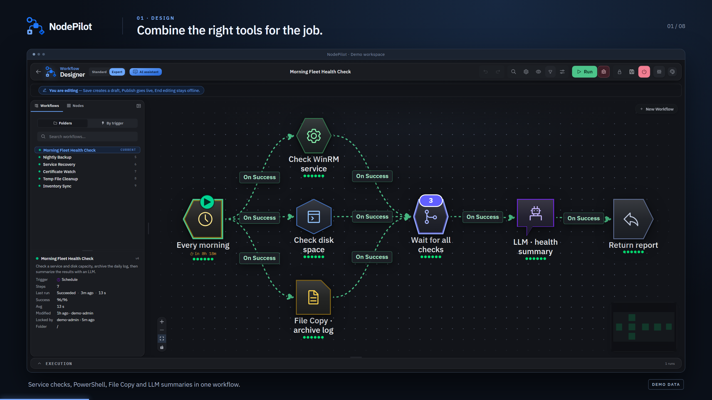
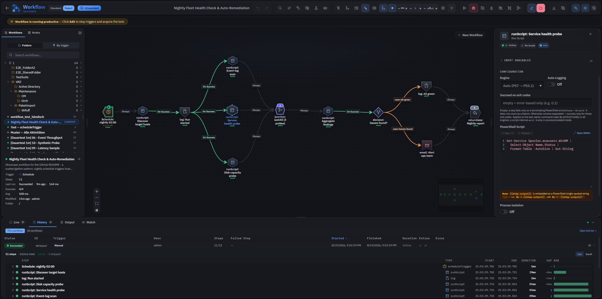
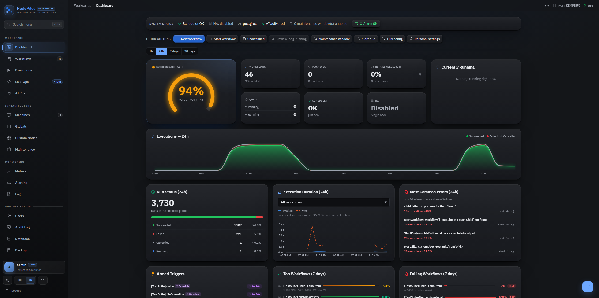
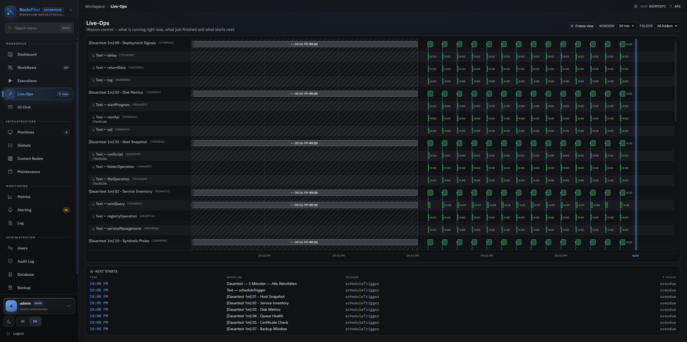
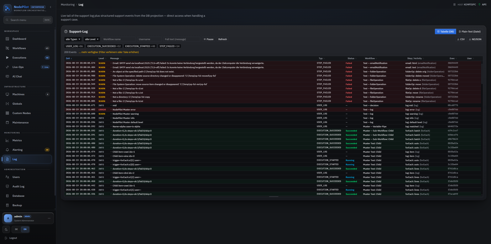

<div align="center">

# NodePilot

**Open-source Windows and PowerShell workflow automation. Self-hosted, agentless execution over WinRM, with an import path for System Center Orchestrator runbooks.**

Multi-step automation is designed, scheduled, debugged and observed in the browser. PowerShell, file, registry and service operations, REST calls, SQL and further activities are executed across a Windows estate over WinRM, without agents on the targets.

[](https://github.com/Sev7eNup/NodePilot/actions/workflows/ci.yml)


[](https://github.com/Sev7eNup/NodePilot/releases/latest)
[](LICENSE)

**[🌐 Website](https://www.nodepilot.run/en/)** · **[▶️ Live demo](https://www.nodepilot.run/demo/)** · **[📚 Documentation](https://www.nodepilot.run/docs/)** · **[⬇️ Download](https://github.com/Sev7eNup/NodePilot/releases/latest)** · **[🚀 Install](https://www.nodepilot.run/docs/en/getting-started/installation/)**

</div>

---

## Live demo

**[Open the live demo](https://www.nodepilot.run/demo/)** to try the actual web UI with sample data. It runs entirely in the browser, requires no installation and sends no data anywhere. Each visitor has a private copy, which resets on reload. Workflows can be built, published and run, while the canvas updates live.

It is the product's own frontend on an in-memory backend, so anything that genuinely needs a server (PowerShell on a host, a WinRM test, mail, a restore) reports that limitation instead of pretending.

## Product tour

[](https://www.nodepilot.run/media/nodepilot-product-tour.mp4)

**[Watch product video](https://www.nodepilot.run/media/nodepilot-product-tour.mp4)**

The video shows SCOrch import, the Workflow Designer, execution history, Live Ops, logs as well as AI chat in operation. English captions, no audio.

<details>
<summary><b>Browse screenshots</b></summary>

<details open>
<summary><b>🎨 Workflow Designer</b></summary>



</details>

<details>
<summary><b>📊 Dashboard</b></summary>



</details>

<details>
<summary><b>🛰️ Live-Ops Mission Control</b></summary>



</details>

<details>
<summary><b>🧾 Support Log, live tail</b></summary>



</details>

</details>

---

## Table of Contents

- [Product tour](#product-tour)
- [Why NodePilot](#why-nodepilot)
- [Coming from System Center Orchestrator](#coming-from-system-center-orchestrator)
- [Install, pick one of three paths](#install-pick-one-of-three-paths)
- [Documentation](#documentation)
- [Project Structure](#project-structure)
- [Testing](#testing)
- [Contributing](#contributing)
- [License](#license)

---

## Why NodePilot

NodePilot is agentless workflow orchestration for Windows, built in the browser and running PowerShell on remote machines over WinRM. It is meant for sysadmins automating Windows estates, for organizations looking for a **modern alternative to SCOrch**, as well as for private users who rely heavily on PowerShell.

**Highlights**

- **Visual designer**: drag-and-drop canvas with 29 activity types, 6 triggers and a visual condition builder.
- **Custom Activities**: your own PowerShell-based activities, reusable from the palette like the built-in ones.
- **Sub-workflows**: a workflow calls another with parameters and gets its return values back.
- **Parallel engine**: branches really run in parallel and meet again at a junction.
- **Step debugger**: breakpoints, step-over, variable inspection and overrides at runtime, replay in the timeline.
- **Live UI**: step status and output appear in real time while a workflow runs.
- **Agentless remote execution**: WinRM and PowerShell, nothing is installed on target machines.
- **Alerting**: notification rules for run events and system conditions, delivered by email or signed webhook.
- **AI-assisted authoring**: scripts and workflows are generated from natural language, also with local models.
- **AI chat**: a read-only assistant that answers from documentation, operational data and, if enabled, the database.
- **AI agent activities**: bounded agent/team workflow steps with evidence, reviews and a reserved final report on investigation model-budget exhaustion. Packaged CMD/Bash reads use checked commands. [Agent guide](docs/ai-agents.md).
- **CLI (`np`)**: every operation from the command line, for scripts and pipelines.
- **MCP server for AI agents**: `nodepilot-mcp` lets Claude Code and other MCP clients drive NodePilot — 112 tools over 11 groups, destructive operations gated.
- **Observability**: OpenTelemetry, Prometheus and a Grafana stack with 10 dashboards.
- **Edit lock**: a workflow is checked out by one user at a time and published atomically, as in SCOrch.
- **Versioning**: every edit is saved as a version, which can be compared and rolled back.
- **Backup and export**: an encrypted backup of the whole configuration, plus workflow export and import for sharing.
- **SCOrch import**: existing `.ois_export` runbooks become NodePilot workflows. [How it works](#coming-from-system-center-orchestrator).
- **Security**: Admin, Operator and Viewer roles, encrypted credentials, secret redaction in output and an audit trail.
- **Folder permissions**: access to workflows can be granted per folder, on top of the global roles.
- **Enterprise (preview)**: AD SSO via LDAP/Kerberos, OIDC and SCIM, Active/Passive HA and SIEM logging. See [docs/enterprise-features.md](docs/enterprise-features.md).
- **Deployment**: installer for a Windows service under a gMSA, in-place upgrades with automatic rollback.
- **Desktop app**: a single installer for one Windows 11 machine, offline and with its own database.
---

## Coming from System Center Orchestrator

SCOrch is not going anywhere. [System Center 2025 Orchestrator](https://learn.microsoft.com/en-us/lifecycle/products/system-center-2025-orchestrator) is supported until 2035, so an existing installation is not on a deadline. The exception is System Center 2016 Orchestrator, whose extended support ends on January 11, 2027. The options side by side are on the [SCOrch alternative page](https://www.nodepilot.run/en/scorch-alternative/).

What has not moved is authoring. Runbooks are still built in the desktop Runbook Designer, without version history, diff or rollback. NodePilot keeps the agentless model and moves the editor, the debugger and the version history into the browser.

**Existing runbooks come across.** NodePilot reads SCOrch's `.ois_export` XML (2012, 2016 and 2019) and turns runbooks into workflows:

- around forty activity types are mapped, including the Runbook Control set
- Published Data references are rewritten to NodePilot's `{{...}}` syntax
- links, conditions, global variables and the folder tree are preserved, as well as the canvas layout
- unmappable activities become disabled placeholders, and the import report lists every lossy translation

```powershell
np workflow import-scorch --file .\runbooks.ois_export
```

Import also runs from the UI and from `POST /api/workflows/import-scorch`. The result is a draft to be reviewed: imported workflows arrive disabled, and credentials are not reconstructed because SCOrch encrypts them. Details are in the [import documentation](https://www.nodepilot.run/docs/en/import-export/).

### How the two compare

| | System Center Orchestrator | NodePilot |
|---|---|---|
| **Support lifecycle** | mainstream to 2030, extended to 2035 | rolling releases, no vendor behind it |
| **Agents on targets** | none | none, same WinRM model |
| **Authoring** | desktop Runbook Designer | browser, live canvas |
| **Debugging** | Runbook Tester | breakpoints in the real engine, variable overrides, replay |
| **Versioning** | none | snapshots, diff, rollback |
| **Automation API** | web API for jobs | full REST API, `np` CLI, MCP server |
| **Observability** | job history | OpenTelemetry, Prometheus, Grafana dashboards |
| **Database** | SQL Server | PostgreSQL or SQL Server |
| **Licence** | commercial, per managed host | Apache-2.0 |
| **Support** | vendor | community, single maintainer |

NodePilot provides the source and no support contract, and it is to be judged on that basis.

---

## Install, pick one of three paths

NodePilot runs in three supported shapes. Each one leads to a working login on its own.

| | **1 · Desktop app** | **2 · Windows service** | **3 · From source** |
|---|---|---|---|
| **For** | one person, one machine | a team, a real server | contributors, evaluation |
| **You need** | Windows 11 x64, local admin | Windows Server 2022/2025, a TLS certificate, a prepared database | .NET 10 SDK, Node, a local PostgreSQL |
| **You get** | installer `.exe` with bundled PostgreSQL and .NET runtime, opens a native window | setup `.exe` (or the signed `.zip` + PowerShell installer), Windows service under a gMSA, Kestrel HTTPS | `dotnet run` + Vite dev server on your own machine |
| **Database** | bundled, loopback-only | you provide it | you provide it |
| **Offline** | yes, fully | yes | no (package restore) |
| **Guide** | [below](#path-1-desktop-app) · [details](deploy/desktop/README.md) | [below](#path-2-windows-service) · [step-by-step](https://www.nodepilot.run/docs/en/deployment/production/) | [below](#path-3-from-source) |

> NodePilot is **Windows-only by design**, because the engine drives PowerShell remoting over WinRM and protects credentials with DPAPI.

On every path the **first login creates the Admin account** with a one-time setup token. Where the token comes from is noted per path.

---

### Path 1: Desktop app

A local application for Windows 11 x64. One `.exe` bundles the app, the .NET 10 runtime and a **local PostgreSQL**, installs them as background services and opens a native window. It works fully **offline**.

`NodePilot-Desktop-Setup-<version>.exe` is downloaded from the [latest release](https://github.com/Sev7eNup/NodePilot/releases/latest) and run with local admin rights. The installer hands the setup token straight to the login screen. Since the backend runs as a service, scheduled and webhook triggers keep firing while the window is closed. Help with problems is in [docs/desktop-troubleshooting.md](docs/desktop-troubleshooting.md), and all log files are listed under [Logs & diagnostics](https://www.nodepilot.run/docs/en/deployment/logs/).

<details>
<summary>Building the installer yourself</summary>

The build requires the **.NET 10 SDK**, **Node**, **[Inno Setup 6](https://jrsoftware.org/isdl.php)** and the `pgsql` folder of the [PostgreSQL 16 binaries](https://www.enterprisedb.com/download-postgresql-binaries).

```powershell
deploy\desktop\Build-DesktopInstaller.ps1 -PgBinariesPath 'C:\Packages\pgsql' -Version 1.2.0
# -> deploy\desktop\out\NodePilot-Desktop-Setup-1.2.0.exe
```

This script does not sign. A signed installer comes from the release build (`deploy\Build-Artifact.ps1 -IncludeDesktopInstaller`), see [`deploy/desktop/README.md`](deploy/desktop/README.md).

</details>

---

### Path 2: Windows service

NodePilot runs as a Windows service under a **gMSA**, with HTTPS directly in Kestrel and in-place upgrades that can roll back.

**Prerequisites**, all checked by the installer's pre-flight:

- **Windows Server 2022 or 2025**, domain-joined for the gMSA path (`-UseLocalSystem` works without a domain)
- **.NET Runtime and ASP.NET Core Runtime 10.0.11+, both x64**. The wizard carries both and installs them if missing. The script path needs both installed beforehand, the standalone runtimes and not the Hosting Bundle
- **PostgreSQL 16+** or **SQL Server 2022 CU1+** (build ≥ 16.0.4003.1, required for `Encrypt=Strict` / TDS 8.0)
- a **TLS certificate** in `Cert:\LocalMachine\My` with its private key
- **antivirus exclusions**, see [docs/av-exclusions.md](docs/av-exclusions.md)

**With the wizard.** `NodePilot-Server-Setup-<version>.exe` from the [latest release](https://github.com/Sev7eNup/NodePilot/releases/latest) checks every prerequisite before changing anything and can install the runtimes, create the database or issue a lab certificate. It also runs unattended: `Setup.exe /VERYSILENT /SUPPRESSMSGBOXES /ANSWERFILE=answers.json`. Details are in [deploy/server/README.md](deploy/server/README.md).

**With the scripts**, which the wizard uses as well. The signed `NodePilot-<version>.zip` is downloaded with its manifest files, verified against `NodePilot-<version>.SHA256SUMS.txt` and installed:

```powershell
.\deploy\Install-NodePilot.ps1 `
    -ArtifactPath 'C:\Packages\NodePilot-1.2.0.zip' `
    -TrustedArtifactSignerThumbprint '<publisher thumbprint from the release notes>' `
    -CertThumbprint '<your TLS cert thumbprint>' `
    -ServiceAccount 'CONTOSO\svc-nodepilot$' `
    -PublicHostname 'nodepilot.corp.example.com'
```

The installer **refuses unsigned or tampered artifacts**. The pinned thumbprint is the trust decision, so no certificate has to be imported beforehand.

Further reading: the [Windows Server deployment](https://www.nodepilot.run/docs/en/deployment/production/) walkthrough, verification and troubleshooting in [docs/deployment-guide.md](docs/deployment-guide.md), and every parameter in [deploy/README.md](deploy/README.md).

---

### Path 3: From source

For contributors and for evaluation on a workstation.

**Prerequisites**

- **Windows 10 / 11** or Windows Server
- **.NET 10 SDK** ([download](https://dotnet.microsoft.com/download)), band pinned in [`global.json`](global.json)
- **Node.js**, at least the version in each `package.json` `engines` field
- **PostgreSQL 16+**, or SQL Server 2022 CU1+ with `Database:Provider: sqlserver`

**1. Create the database**

```powershell
winget install PostgreSQL.PostgreSQL
$psql = "C:\Program Files\PostgreSQL\16\bin\psql.exe"
& $psql -U postgres -c "CREATE ROLE nodepilot WITH LOGIN PASSWORD 'ChangeMe!';"
& $psql -U postgres -c "CREATE DATABASE nodepilot OWNER nodepilot;"
```

**2. Start the backend (port 5000)**

The password is passed through the environment, so that it never lands in a tracked file:

```powershell
$env:ConnectionStrings__Postgres = "Host=127.0.0.1;Port=5432;Database=nodepilot;Username=nodepilot;Password=ChangeMe!;SSL Mode=Disable"
cd src\NodePilot.Api
dotnet run
```

On first start the setup token is written to `src\NodePilot.Api\admin-setup.token`. The login screen asks for it on the first attempt and then creates the Admin account.

**3. Start the frontend (port 5173)**

```powershell
cd src\nodepilot-ui
npm install
npm run dev
```

<http://localhost:5173> serves the app and proxies `/api`, `/healthz` and `/hubs` to port 5000.

**4. (optional) Bring up Grafana**

```powershell
cd grafana
Copy-Item .env.example .env     # then set NODEPILOT_GRAFANA_ADMIN_PASSWORD
docker compose up -d
# Grafana    -> http://localhost:3000   (user "admin", the password you just set)
# Prometheus -> http://localhost:9090
```

Startup requires a unique `NODEPILOT_GRAFANA_ADMIN_PASSWORD`. Compose fails closed while the password is missing. On the API side, these three variables enable the Prometheus endpoint:

```powershell
$env:OpenTelemetry__Enabled = "true"
$env:OpenTelemetry__Exporters__PrometheusScrape = "true"
$env:OpenTelemetry__Exporters__PrometheusScrapeAllowAnonymous = "true"
```

More in [grafana/README.md](grafana/README.md) and in the installation guide on the documentation site, in [English](https://www.nodepilot.run/docs/en/getting-started/installation/) and [German](https://www.nodepilot.run/docs/de/getting-started/installation/).

---

### Example workflow

`scripts/readme-showcase-workflow.json` is a nightly health check that runs three probes in parallel, gathers them at a junction and then either sends an alert or logs that all is well. It is imported on the **Workflows** page via *Import* or through `POST /api/workflows/import`.

---

## Documentation

Everything below the surface lives on the **[documentation site](https://www.nodepilot.run/docs/)**, 45 pages in English and German, with search and deep links. This README deliberately stops at "installed and logged in".

| | |
|---|---|
| **Start here** | [Introduction](https://www.nodepilot.run/docs/en/getting-started/introduction/) · [Installation](https://www.nodepilot.run/docs/en/getting-started/installation/) · [Architecture](https://www.nodepilot.run/docs/en/getting-started/architecture/) |
| **Building workflows** | [Workflows & activities](https://www.nodepilot.run/docs/en/concepts/workflows/) · [Data bus & variables](https://www.nodepilot.run/docs/en/concepts/data-bus/) · [Edge conditions](https://www.nodepilot.run/docs/en/concepts/edge-conditions/) · [Sub-workflows](https://www.nodepilot.run/docs/en/concepts/sub-workflows/) |
| **The designer** | [Overview](https://www.nodepilot.run/docs/en/designer/overview/) · [Canvas, nodes & edges](https://www.nodepilot.run/docs/en/designer/canvas-nodes-edges/) · [Properties, modes & shortcuts](https://www.nodepilot.run/docs/en/designer/properties-modes/) |
| **Reference** | [All 29 activities](https://www.nodepilot.run/docs/en/activities-reference/) · [Triggers](https://www.nodepilot.run/docs/en/triggers/) · [API endpoints](https://www.nodepilot.run/docs/en/api/endpoints/) · [`np` CLI](https://www.nodepilot.run/docs/en/cli/) · [MCP server](https://www.nodepilot.run/docs/en/mcp-server/) |
| **Running it** | [Windows Server](https://www.nodepilot.run/docs/en/deployment/production/) · [Desktop app](https://www.nodepilot.run/docs/en/deployment/desktop/) · [Antivirus exclusions](https://www.nodepilot.run/docs/en/deployment/av-exclusions/) · [Logs & diagnostics](https://www.nodepilot.run/docs/en/deployment/logs/) · [Configuration](https://www.nodepilot.run/docs/en/configuration/appsettings/) |
| **Security** | [Security model](https://www.nodepilot.run/docs/en/security/overview/) · [Hardening flags](https://www.nodepilot.run/docs/en/security/hardening/) · [Audit log](https://www.nodepilot.run/docs/en/security/audit-log/) |
| **Enterprise** | [High availability](https://www.nodepilot.run/docs/en/enterprise/high-availability/) · [Secret providers](https://www.nodepilot.run/docs/en/enterprise/secrets-providers/) · [AD SSO Preview](https://www.nodepilot.run/docs/en/enterprise/ldap-windows-sso/) · [Folder RBAC](https://www.nodepilot.run/docs/en/enterprise/folder-rbac/) |

The API also documents itself. The OpenAPI spec is served at `GET /openapi/v1.json`, with Swagger UI at `GET /swagger`, in Development by default.

### Production deployment

A real server rollout follows **[Windows Server deployment](https://www.nodepilot.run/docs/en/deployment/production/)** on the documentation site, a lab-validated walkthrough covering service identity, both database providers, certificates and the first admin account. The installer runs NodePilot as a Windows service under a gMSA with direct Kestrel HTTPS, splits install and data directories, and upgrades in place with automatic rollback.

Two companions belong to it. [docs/deployment-guide.md](docs/deployment-guide.md) covers what happens *before* installation (verifying the download against its checksums and publisher, and building the artifact in-house) and carries the troubleshooting table. [deploy/README.md](deploy/README.md) is the parameter reference, and states what the installer deliberately does *not* do.

Before a deployment into an environment with endpoint protection, [docs/av-exclusions.md](docs/av-exclusions.md) is to be handed to whoever owns it. NodePilot runs PowerShell by design, and that trips heuristics.

---

## Project Structure

```
src/
  NodePilot.Core/         Domain models, interfaces, enums (zero dependencies)
  NodePilot.Ai/           LLM stack: ILlmClient/OpenAI transport + SSRF guard, prompt catalog, script/workflow gen + chat assistant (Core-only; used by Api and Engine)
  NodePilot.Data/         EF Core DbContext, CredentialStore (DPAPI), provider-agnostic migrations
  NodePilot.Remote/       WinRM session factory + PowerShell SDK session
  NodePilot.Engine/       WorkflowEngine, 29 activities, RetryPolicy, DebugCoordinator
  NodePilot.Scheduler/    TriggerOrchestrator (Quartz.NET), 4 polling trigger sources + retention/cluster services
  NodePilot.Telemetry/    OpenTelemetry setup, Prometheus client, metric constants
  NodePilot.Api/          ASP.NET Core host, controllers, SignalR hub, security middleware
  NodePilot.Cli/          `np`: operations CLI (Spectre.Console.Cli), shipped in both installers under tools\np
  NodePilot.Mcp/          `nodepilot-mcp`: MCP server for AI agents (ModelContextProtocol), shipped under tools\mcp
  NodePilot.Switcher/     WPF utility for exclusive local NodePilot/SCOrch service control
  nodepilot-ui/           React 19 SPA (Vite 8 + Tailwind CSS 4 + React Flow 12)
  nodepilot-docs-ui/      Documentation website (Vite + React SPA): its OWN curated markdown corpus under content/{de,en}/, maintained alongside docs/ (not a 1:1 render)
  nodepilot-desktop/      Electron shell for the desktop app: thin hardened viewer, no business logic

tests/
  NodePilot.Engine.Tests/   xUnit: engine + every activity executor
  NodePilot.Ai.Tests/       xUnit: LLM client factory, endpoint guard, prompt catalog, gen/chat services
  NodePilot.Data.Tests/     xUnit: EF context + migrations
  NodePilot.Api.Tests/      xUnit: controllers, auth, telemetry, validation
  NodePilot.Cli.Tests/      xUnit + WireMock.Net: CLI ApiClient + DPAPI TokenStore
  NodePilot.Mcp.Tests/      xUnit + WireMock.Net: MCP tools + stdio-process smoke test
  NodePilot.LoadTests/      Standalone load harness (Console EXE, HdrHistogram)
  NodePilot.Switcher.Tests/ xUnit - discovery, state machine, fail-closed switching
  NodePilot.TestCommons/    Shared test infrastructure (TestDbFactory, FakeLlmClient, fixtures)

grafana/                  Docker-compose stack: Prometheus + Grafana + 10 dashboards
deploy/                   Production install / update / uninstall PowerShell scripts
docs/                     Feature docs (AI, styleguide, perf, security, deployment)
samples/                  Example workflows for the importer
```

**Dependency graph:**
`Api → Ai, Engine, Scheduler, Data, Remote, Core, Telemetry`
`Engine → Ai, Data, Remote, Core, Telemetry`
`Ai → Core` · `Data → Core` · `Remote → Core` · `Telemetry → Core`
`Cli → Core` · `Mcp → Core` *(HTTP-only, no backend project references)*

---

## Testing

Six CI jobs gate every pull request and every push to `main`: backend build and tests with an enforced **85 % line / 70 % branch** coverage gate, frontend lint/build/vitest, docs-site lint/tests/build, desktop-shell typecheck and tests, as well as hermetic Playwright E2E. A local nightly task runs the same four suites against the checked-out tree.

**Tests are mandatory.** Every behaviour change ships with tests in the same change. Which tests you run locally is scoped to what you touched. The full suite is CI's responsibility, not yours. Commands, the scoping rules and the guard-test mapping are documented in [CONTRIBUTING.md](CONTRIBUTING.md#build--test) and [CLAUDE.md](CLAUDE.md).

Two conventions are worth knowing beforehand: the WinRM remote layer is **always mocked**, and backend database tests run on **in-memory SQLite**, a test backend only, never a supported production provider.

---

## Contributing

Contributions are welcome. **[CONTRIBUTING.md](CONTRIBUTING.md)** has the full setup: prerequisites, how to obtain a local PostgreSQL and a first admin account, the build and test commands, as well as the conventions that CI enforces.

The short version:

1. **Open an issue first** for anything non-trivial, it saves a round of "we already explored that" review comments.
2. **Tests ship with the change**, not after it. CI fails without them.
3. **No backwards-compat shims.** NodePilot is greenfield, replace cleanly rather than keeping the old path alive behind a flag.
4. **Hand-built workflow JSON** requires [docs/workflow-styleguide.md](docs/workflow-styleguide.md) first, layout rules, edge-label conventions, and engine gotchas.

A security problem does not belong in a public issue. [SECURITY.md](SECURITY.md) has the private reporting path. Everyone taking part is expected to follow the [Code of Conduct](CODE_OF_CONDUCT.md).

`CLAUDE.md` is working notes for AI coding agents, not contributor documentation. It is checked in deliberately: NodePilot is built with agentic engineering, so the context an agent needs to work on this codebase belongs in the repository rather than in someone's private setup. What that does not change is the bar every change has to clear, behaviour changes ship with tests, and CI enforces the coverage gate on every pull request. [CONTRIBUTING.md](CONTRIBUTING.md) is the file written for people.

---

## License

NodePilot is licensed under the [Apache License 2.0](LICENSE). Use, modification and distribution are permitted, including commercially, provided that the copyright and license notices are retained. See [LICENSE](LICENSE) for the full text.

---

## Acknowledgments

- **System Center Orchestrator**: for proving that visual workflow orchestration on Windows is a real need, and for inspiring the per-user check-out / publish lifecycle.
- **[React Flow](https://reactflow.dev/)**: the canvas library underneath the designer.
- **[Quartz.NET](https://www.quartz-scheduler.net/)**: the cron engine behind `scheduleTrigger`.
- **[Serilog](https://serilog.net/)**: structured logging across the stack.
- **[OpenTelemetry](https://opentelemetry.io/)**: vendor-neutral traces & metrics.
- **[Spectre.Console](https://spectreconsole.net/)**: the CLI presentation layer.

---

## Further Reading

- **[📚 www.nodepilot.run/docs](https://www.nodepilot.run/docs/)**, the documentation website. 45 pages in English and German, with search, sidebar navigation and light/dark themes. Start at [Introduction](https://www.nodepilot.run/docs/en/getting-started/introduction/) or jump to [Installation](https://www.nodepilot.run/docs/en/getting-started/installation/). **The same site ships with the product**, every installation serves it at `/docs`, without a login and without internet access, at the version actually installed.
- **[CLAUDE.md](CLAUDE.md)**: architecture conventions, full activity/trigger reference, variable resolution details, edge-condition grammar, test guidelines, and the complete API endpoint table.
- **[src/nodepilot-docs-ui/](src/nodepilot-docs-ui/)**: standalone documentation website (Vite + React SPA) with client-side search, sidebar navigation, light/dark theme, and **English/German** via i18next (the language lives in the path: `/docs/en/…`, `/docs/de/…`). Note: it ships its own curated markdown corpus under `content/en/` and `content/de/`, changes to `docs/` must be mirrored there deliberately, since it is not a 1:1 render, and both languages must be kept in step or the parity test fails. It has two deployments: the public webspace at `www.nodepilot.run/docs/`, published by `deploy/Publish-Site.ps1`, and `wwwroot/docs` inside the server artifact and desktop package, which the API serves at `/docs`. The project website (`src/site/`, English and German) is a separate build published only to the webspace. GitHub Pages forwards old links to the matching public pages. The product ships the documentation alone.
- **[docs/workflow-designer-features.md](docs/workflow-designer-features.md)**: complete feature inventory of the workflow designer (canvas, nodes, edges, properties, overlays, modes, shortcuts, mobile), organized by area.
- **[docs/workflow-styleguide.md](docs/workflow-styleguide.md)**: layout rules, edge-label conventions, and engine gotchas for hand-built workflow JSON.
- **[docs/ai-features.md](docs/ai-features.md)**: LLM configuration, recommended models, security model, error taxonomy.
- **[docs/performance-improvements.md](docs/performance-improvements.md)**: capacity tuning playbook (parallel workflow targets, runspace pools, DB pool sizing).
- **[docs/security-findings.md](docs/security-findings.md)**: register of resolved security findings with fix and test, by severity.
- **[docs/av-exclusions.md](docs/av-exclusions.md)**: antivirus/EDR exclusions for the server and desktop roles (folders, processes, temp-file patterns, behaviour rules), each with its rationale and residual risk. It is written to be handed to a security team.
- **[docs/enterprise-features.md](docs/enterprise-features.md)**: enterprise features, configuration switches and release gates, including the current AD SSO Preview.
- **[docs/ha-active-passive.md](docs/ha-active-passive.md)**: Active/Passive HA setup, lease/fencing model, failover RTO.
- **[docs/secrets-providers.md](docs/secrets-providers.md)**: secret-provider operator runbook (DPAPI ↔ AES-GCM migration).
- **[docs/ldap-windows-sso.md](docs/ldap-windows-sso.md)**: LDAPS, Windows Negotiate/Kerberos, OIDC and SCIM setup and field-test checklist.
- **[docs/roadmap.md](docs/roadmap.md)**, the roadmap. What is committed, what is trigger-gated, what was deliberately ruled out and why.
- **[grafana/README.md](grafana/README.md)**: Prometheus + Grafana stack walk-through.
- **[deploy/README.md](deploy/README.md)**: production deployment operator manual (Windows Service, external DB).
- **[docs/switcher.md](docs/switcher.md)**: local NodePilot/System Center switcher behavior and safety model.
- **[deploy/desktop/README.md](deploy/desktop/README.md)**, desktop app. Offline one-click installer with bundled PostgreSQL, plus the fast dev loop for iterating without rebuilding the installer.
- **[docs/desktop-troubleshooting.md](docs/desktop-troubleshooting.md)**, desktop app troubleshooting. Log locations, first-run setup recovery, port conflicts, and how to remove it completely.
